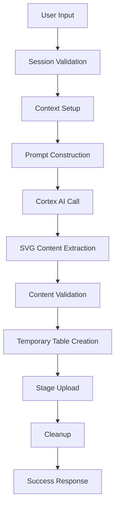

# Data Models for SVG Image Generation System

## Entity Relationship Model

### Core Entities

#### 1. User Session
```yaml
Entity: UserSession
Attributes:
  - session_id: UUID (Primary Key)
  - user_role: STRING
  - warehouse: STRING
  - database: STRING
  - schema: STRING
  - created_at: TIMESTAMP
  - last_activity: TIMESTAMP
  - is_active: BOOLEAN
```

#### 2. SVG Generation Request
```yaml
Entity: SVGGenerationRequest
Attributes:
  - request_id: UUID (Primary Key)
  - session_id: UUID (Foreign Key -> UserSession)
  - prompt_text: STRING
  - selected_model: STRING
  - filename: STRING
  - stage_name: STRING
  - created_at: TIMESTAMP
  - status: ENUM('pending', 'processing', 'completed', 'failed')
  - error_message: STRING (nullable)
```

#### 3. Generated SVG
```yaml
Entity: GeneratedSVG
Attributes:
  - svg_id: UUID (Primary Key)
  - request_id: UUID (Foreign Key -> SVGGenerationRequest)
  - svg_content: STRING (CLOB)
  - file_size: INTEGER
  - stage_path: STRING
  - generated_at: TIMESTAMP
  - model_used: STRING
  - processing_time_ms: INTEGER
```

#### 4. Snowflake Stage
```yaml
Entity: SnowflakeStage
Attributes:
  - stage_name: STRING (Primary Key)
  - database: STRING
  - schema: STRING
  - url: STRING
  - storage_integration: STRING (nullable)
  - encryption: STRING
  - created_at: TIMESTAMP
  - last_modified: TIMESTAMP
```

#### 5. Temporary Table
```yaml
Entity: TemporaryTable
Attributes:
  - table_name: STRING (Primary Key)
  - request_id: UUID (Foreign Key -> SVGGenerationRequest)
  - schema: STRING
  - created_at: TIMESTAMP
  - cleaned_up_at: TIMESTAMP (nullable)
  - table_type: ENUM('TRANSIENT', 'TEMPORARY')
```

## Data Flow Models

### 1. SVG Generation Flow


### 2. Data Transformation Pipeline
```yaml
Pipeline: SVGGenerationPipeline
Stages:
  1. Input Processing:
     - Text sanitization
     - Model validation
     - Filename generation
  2. AI Processing:
     - Prompt engineering
     - Cortex API call
     - Response parsing
  3. Content Processing:
     - SVG extraction
     - Format validation
     - Size calculation
  4. Storage Processing:
     - Temporary table creation
     - Content insertion
     - Stage copy operation
  5. Cleanup:
     - Temporary table removal
     - Resource deallocation
```

## Schema Definitions

### 1. User Session Schema
```sql
CREATE OR REPLACE TABLE user_sessions (
    session_id STRING PRIMARY KEY,
    user_role STRING NOT NULL,
    warehouse STRING NOT NULL,
    database STRING,
    schema STRING,
    created_at TIMESTAMP_NTZ DEFAULT CURRENT_TIMESTAMP(),
    last_activity TIMESTAMP_NTZ DEFAULT CURRENT_TIMESTAMP(),
    is_active BOOLEAN DEFAULT TRUE
);
```

### 2. SVG Generation Requests Schema
```sql
CREATE OR REPLACE TABLE svg_generation_requests (
    request_id STRING PRIMARY KEY,
    session_id STRING REFERENCES user_sessions(session_id),
    prompt_text STRING NOT NULL,
    selected_model STRING NOT NULL,
    filename STRING NOT NULL,
    stage_name STRING NOT NULL,
    created_at TIMESTAMP_NTZ DEFAULT CURRENT_TIMESTAMP(),
    status STRING DEFAULT 'pending',
    error_message STRING,
    CONSTRAINT valid_status CHECK (status IN ('pending', 'processing', 'completed', 'failed'))
);
```

### 3. Generated SVGs Schema
```sql
CREATE OR REPLACE TABLE generated_svgs (
    svg_id STRING PRIMARY KEY,
    request_id STRING REFERENCES svg_generation_requests(request_id),
    svg_content STRING NOT NULL,
    file_size INTEGER NOT NULL,
    stage_path STRING NOT NULL,
    generated_at TIMESTAMP_NTZ DEFAULT CURRENT_TIMESTAMP(),
    model_used STRING NOT NULL,
    processing_time_ms INTEGER,
    CONSTRAINT positive_file_size CHECK (file_size > 0),
    CONSTRAINT positive_processing_time CHECK (processing_time_ms >= 0)
);
```

### 4. Temporary Tables Schema
```sql
CREATE OR REPLACE TABLE temporary_tables (
    table_name STRING PRIMARY KEY,
    request_id STRING REFERENCES svg_generation_requests(request_id),
    schema STRING NOT NULL,
    created_at TIMESTAMP_NTZ DEFAULT CURRENT_TIMESTAMP(),
    cleaned_up_at TIMESTAMP_NTZ,
    table_type STRING DEFAULT 'TRANSIENT',
    CONSTRAINT valid_table_type CHECK (table_type IN ('TRANSIENT', 'TEMPORARY'))
);
```

## Data Validation Rules

### 1. Input Validation
```yaml
Validation Rules:
  - prompt_text:
      - min_length: 10
      - max_length: 1000
      - required: true
      - pattern: "^[a-zA-Z0-9\\s\\-\\.\\,\\!\\?\\'\"]+$"
  
  - selected_model:
      - allowed_values: ["openai-gpt-4.1", "claude-4-sonnet", "claude-3-7-sonnet", "claude-3-5-sonnet"]
      - required: true
  
  - filename:
      - min_length: 1
      - max_length: 255
      - pattern: "^[a-zA-Z0-9\\_\\-]+$"
      - required: true
  
  - stage_name:
      - min_length: 1
      - max_length: 255
      - pattern: "^[A-Z][A-Z0-9_]*$"
      - required: true
```

### 2. SVG Content Validation
```yaml
SVG Validation:
  - must_start_with: "<svg"
  - must_end_with: "</svg>"
  - must_contain_viewbox: true
  - max_size_bytes: 1048576  # 1MB
  - allowed_elements: ["svg", "rect", "circle", "ellipse", "line", "polyline", "polygon", "path", "text", "g", "defs", "style"]
  - forbidden_attributes: ["onclick", "onload", "onerror", "javascript:"]
```

## Data Access Patterns

### 1. Read Patterns
```yaml
Frequent Queries:
  - Get active session info
  - List stage contents
  - Retrieve SVG by request ID
  - Get generation history
  - Check temporary table status
```

### 2. Write Patterns
```yaml
Write Operations:
  - Create temporary table
  - Insert SVG content
  - Update request status
  - Clean up temporary resources
  - Log generation metrics
```

## Performance Considerations

### 1. Indexing Strategy
```sql
-- Primary indexes (already defined)
-- Secondary indexes for performance
CREATE INDEX idx_svg_requests_session ON svg_generation_requests(session_id);
CREATE INDEX idx_svg_requests_status ON svg_generation_requests(status);
CREATE INDEX idx_svg_requests_created ON svg_generation_requests(created_at);
CREATE INDEX idx_generated_svgs_request ON generated_svgs(request_id);
CREATE INDEX idx_temp_tables_request ON temporary_tables(request_id);
```

### 2. Partitioning Strategy
```yaml
Partitioning:
  - svg_generation_requests: PARTITION BY DATE(created_at)
  - generated_svgs: PARTITION BY DATE(generated_at)
  - user_sessions: PARTITION BY DATE(created_at)
```

### 3. Clustering Strategy
```yaml
Clustering:
  - svg_generation_requests: CLUSTER BY (session_id, status)
  - generated_svgs: CLUSTER BY (request_id, model_used)
  - temporary_tables: CLUSTER BY (request_id, table_type)
```

## Data Retention Policies

### 1. Temporary Data
```yaml
Retention Rules:
  - temporary_tables: Clean up immediately after use
  - session_cache: TTL of 1 hour
  - error_logs: Retain for 30 days
```

### 2. Persistent Data
```yaml
Retention Rules:
  - svg_generation_requests: Retain for 1 year
  - generated_svgs: Retain for 2 years
  - user_sessions: Retain for 90 days
  - stage_files: Retain indefinitely (user managed)
```

## Data Security Model

### 1. Encryption
```yaml
Encryption Standards:
  - data_at_rest: AES-256
  - data_in_transit: TLS 1.3
  - temporary_data: Transient encryption
```

### 2. Access Control
```yaml
Access Levels:
  - user: Can only access own data
  - admin: Can access all data
  - system: Can access temporary resources
```

### 3. Data Masking
```yaml
Masking Rules:
  - error_messages: Mask sensitive information
  - session_details: Mask connection strings
  - file_paths: Sanitize for logging
``` 