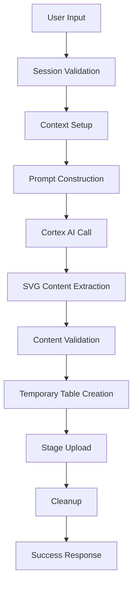

# Data Models for SVG Image Generation System

## Entity Relationship Model

### Core Entities

#### 1. User Session
```yaml
Entity: UserSession
Attributes:
  - session_id: UUID (Primary Key)
  - user_role: STRING
  - warehouse: STRING
  - database: STRING
  - schema: STRING
  - created_at: TIMESTAMP
  - last_activity: TIMESTAMP
  - is_active: BOOLEAN
```

#### 2. SVG Generation Request
```yaml
Entity: SVGGenerationRequest
Attributes:
  - request_id: UUID (Primary Key)
  - session_id: UUID (Foreign Key -> UserSession)
  - prompt_text: STRING
  - selected_model: STRING
  - filename: STRING
  - stage_name: STRING
  - created_at: TIMESTAMP
  - status: ENUM('pending', 'processing', 'completed', 'failed')
  - error_message: STRING (nullable)
```

#### 3. Generated SVG
```yaml
Entity: GeneratedSVG
Attributes:
  - svg_id: UUID (Primary Key)
  - request_id: UUID (Foreign Key -> SVGGenerationRequest)
  - svg_content: STRING (CLOB)
  - file_size: INTEGER
  - stage_path: STRING
  - generated_at: TIMESTAMP
  - model_used: STRING
  - processing_time_ms: INTEGER
```

#### 4. Snowflake Stage
```yaml
Entity: SnowflakeStage
Attributes:
  - stage_name: STRING (Primary Key)
  - database: STRING
  - schema: STRING
  - url: STRING
  - storage_integration: STRING (nullable)
  - encryption: STRING
  - created_at: TIMESTAMP
  - last_modified: TIMESTAMP
```

#### 5. Temporary Table
```yaml
Entity: TemporaryTable
Attributes:
  - table_name: STRING (Primary Key)
  - request_id: UUID (Foreign Key -> SVGGenerationRequest)
  - schema: STRING
  - created_at: TIMESTAMP
  - cleaned_up_at: TIMESTAMP (nullable)
  - table_type: ENUM('TRANSIENT', 'TEMPORARY')
```

## Data Flow Models

### 1. SVG Generation Flow


### 2. Data Transformation Pipeline
```yaml
Pipeline: SVGGenerationPipeline
Stages:
  1. Input Processing:
     - Text sanitization
     - Model validation
     - Filename generation
  2. AI Processing:
     - Prompt engineering
     - Cortex API call
     - Response parsing
  3. Content Processing:
     - SVG extraction
     - Format validation
     - Size calculation
  4. Storage Processing:
     - Temporary table creation
     - Content insertion
     - Stage copy operation
  5. Cleanup:
     - Temporary table removal
     - Resource deallocation
```

## Schema Definitions

### 1. User Session Schema
```sql
CREATE OR REPLACE TABLE user_sessions (
    session_id STRING PRIMARY KEY,
    user_role STRING NOT NULL,
    warehouse STRING NOT NULL,
    database STRING,
    schema STRING,
    created_at TIMESTAMP_NTZ DEFAULT CURRENT_TIMESTAMP(),
    last_activity TIMESTAMP_NTZ DEFAULT CURRENT_TIMESTAMP(),
    is_active BOOLEAN DEFAULT TRUE
);
```

### 2. SVG Generation Requests Schema
```sql
CREATE OR REPLACE TABLE svg_generation_requests (
    request_id STRING PRIMARY KEY,
    session_id STRING REFERENCES user_sessions(session_id),
    prompt_text STRING NOT NULL,
    selected_model STRING NOT NULL,
    filename STRING NOT NULL,
    stage_name STRING NOT NULL,
    created_at TIMESTAMP_NTZ DEFAULT CURRENT_TIMESTAMP(),
    status STRING DEFAULT 'pending',
    error_message STRING,
    CONSTRAINT valid_status CHECK (status IN ('pending', 'processing', 'completed', 'failed'))
);
```

### 3. Generated SVGs Schema
```sql
CREATE OR REPLACE TABLE generated_svgs (
    svg_id STRING PRIMARY KEY,
    request_id STRING REFERENCES svg_generation_requests(request_id),
    svg_content STRING NOT NULL,
    file_size INTEGER NOT NULL,
    stage_path STRING NOT NULL,
    generated_at TIMESTAMP_NTZ DEFAULT CURRENT_TIMESTAMP(),
    model_used STRING NOT NULL,
    processing_time_ms INTEGER,
    CONSTRAINT positive_file_size CHECK (file_size > 0),
    CONSTRAINT positive_processing_time CHECK (processing_time_ms >= 0)
);
```

### 4. Temporary Tables Schema
```sql
CREATE OR REPLACE TABLE temporary_tables (
    table_name STRING PRIMARY KEY,
    request_id STRING REFERENCES svg_generation_requests(request_id),
    schema STRING NOT NULL,
    created_at TIMESTAMP_NTZ DEFAULT CURRENT_TIMESTAMP(),
    cleaned_up_at TIMESTAMP_NTZ,
    table_type STRING DEFAULT 'TRANSIENT',
    CONSTRAINT valid_table_type CHECK (table_type IN ('TRANSIENT', 'TEMPORARY'))
);
```

## Data Validation Rules

### 1. Input Validation
```yaml
Validation Rules:
  - prompt_text:
      - min_length: 10
      - max_length: 1000
      - required: true
      - pattern: "^[a-zA-Z0-9\\s\\-\\.\\,\\!\\?\\'\"]+$"

  - selected_model:
      - allowed_values: ["openai-gpt-4.1", "claude-4-sonnet", "claude-3-7-sonnet", "claude-3-5-sonnet"]
      - required: true

  - filename:
      - min_length: 1
      - max_length: 255
      - pattern: "^[a-zA-Z0-9\\_\\-]+$"
      - required: true

  - stage_name:
      - min_length: 1
      - max_length: 255
      - pattern: "^[A-Z][A-Z0-9_]*$"
      - required: true
```

### 2. SVG Content Validation
```yaml
SVG Validation:
  - must_start_with: "<svg"
  - must_end_with: "</svg>"
  - must_contain_viewbox: true
  - max_size_bytes: 1048576  # 1MB
  - allowed_elements: ["svg", "rect", "circle", "ellipse", "line", "polyline", "polygon", "path", "text", "g", "defs", "style"]
  - forbidden_attributes: ["onclick", "onload", "onerror", "javascript:"]
```

## Data Access Patterns

### 1. Read Patterns
```yaml
Frequent Queries:
  - Get active session info
  - List stage contents
  - Retrieve SVG by request ID
  - Get generation history
  - Check temporary table status
```

### 2. Write Patterns
```yaml
Write Operations:
  - Create temporary table
  - Insert SVG content
  - Update request status
  - Clean up temporary resources
  - Log generation metrics
```

## Performance Considerations

### 1. Indexing Strategy
```sql
-- Primary indexes (already defined)
-- Secondary indexes for performance
CREATE INDEX idx_svg_requests_session ON svg_generation_requests(session_id);
CREATE INDEX idx_svg_requests_status ON svg_generation_requests(status);
CREATE INDEX idx_svg_requests_created ON svg_generation_requests(created_at);
CREATE INDEX idx_generated_svgs_request ON generated_svgs(request_id);
CREATE INDEX idx_temp_tables_request ON temporary_tables(request_id);
```

### 2. Partitioning Strategy
```yaml
Partitioning:
  - svg_generation_requests: PARTITION BY DATE(created_at)
  - generated_svgs: PARTITION BY DATE(generated_at)
  - user_sessions: PARTITION BY DATE(created_at)
```

### 3. Clustering Strategy
```yaml
Clustering:
  - svg_generation_requests: CLUSTER BY (session_id, status)
  - generated_svgs: CLUSTER BY (request_id, model_used)
  - temporary_tables: CLUSTER BY (request_id, table_type)
```

## Data Retention Policies

### 1. Temporary Data
```yaml
Retention Rules:
  - temporary_tables: Clean up immediately after use
  - session_cache: TTL of 1 hour
  - error_logs: Retain for 30 days
```

### 2. Persistent Data
```yaml
Retention Rules:
  - svg_generation_requests: Retain for 1 year
  - generated_svgs: Retain for 2 years
  - user_sessions: Retain for 90 days
  - stage_files: Retain indefinitely (user managed)
```

## Data Security Model

### 1. Encryption
```yaml
Encryption Standards:
  - data_at_rest: AES-256
  - data_in_transit: TLS 1.3
  - temporary_data: Transient encryption
```

### 2. Access Control
```yaml
Access Levels:
  - user: Can only access own data
  - admin: Can access all data
  - system: Can access temporary resources
```

### 3. Data Masking
```yaml
Masking Rules:
  - error_messages: Mask sensitive information
  - session_details: Mask connection strings
  - file_paths: Sanitize for logging
```

## Core Data Models

### 1. Application State Models

#### A. Session State Model
```yaml
Model: SessionState
Purpose: Application session state management
Properties:
  - session: Snowflake session object
  - is_connected: Boolean connection status
  - current_context: Context information
  - error_state: Error information
  - cache_data: Cached data dictionary

Context Information:
  - database: String database name
  - schema: String schema name
  - warehouse: String warehouse name
  - role: String role name

Error Information:
  - has_error: Boolean error status
  - error_message: String error description
  - error_type: String error category
  - error_timestamp: DateTime error occurrence

Cached Data:
  - stage_contents: List of stage files
  - configuration: Application configuration
  - type_stubs: Type stub information
  - validation_results: Validation cache
```

#### B. User Input Model
```yaml
Model: UserInput
Purpose: User input validation and processing
Properties:
  - prompt_text: String SVG description
  - selected_model: String AI model name
  - filename: String output filename
  - stage_name: String Snowflake stage name
  - database: String target database
  - schema: String target schema

Validation Rules:
  - prompt_text: Required, non-empty, max 1000 chars
  - selected_model: Required, valid model name
  - filename: Required, valid filename format
  - stage_name: Required, valid Snowflake identifier
  - database: Optional, valid Snowflake identifier
  - schema: Optional, valid Snowflake identifier

Model Options:
  - openai-gpt-4.1
  - claude-4-sonnet
  - claude-3-7-sonnet
  - claude-3-5-sonnet
```

#### C. Generation Request Model
```yaml
Model: GenerationRequest
Purpose: AI generation request structure
Properties:
  - request_id: String unique identifier
  - prompt: String processed prompt
  - model: String selected model
  - parameters: Dictionary model parameters
  - timestamp: DateTime request time
  - user_context: User context information

Model Parameters:
  - temperature: Float creativity level (0.0-1.0)
  - max_tokens: Integer maximum response length
  - top_p: Float nucleus sampling parameter
  - frequency_penalty: Float repetition penalty
  - presence_penalty: Float topic penalty

User Context:
  - session_id: String session identifier
  - user_id: String user identifier
  - environment: String deployment environment
  - permissions: List of user permissions
```

### 2. AI Response Models

#### A. Cortex Response Model
```yaml
Model: CortexResponse
Purpose: Snowflake Cortex AI response structure
Properties:
  - response_id: String unique identifier
  - content: String raw response content
  - model_used: String model identifier
  - generation_time: Float processing time
  - tokens_used: Integer token count
  - cost: Float estimated cost
  - status: String response status

Response Status:
  - success: Successful generation
  - error: Generation error
  - timeout: Request timeout
  - rate_limited: Rate limit exceeded
  - invalid_input: Invalid input error

Content Processing:
  - raw_content: String unprocessed content
  - svg_content: String extracted SVG
  - validation_status: String validation result
  - processing_errors: List of processing errors
```

#### B. SVG Content Model
```yaml
Model: SVGContent
Purpose: SVG content validation and processing
Properties:
  - content: String SVG markup
  - filename: String output filename
  - size_bytes: Integer content size
  - validation_status: String validation result
  - processing_metadata: Dictionary metadata

Validation Status:
  - valid: Valid SVG content
  - invalid: Invalid SVG content
  - partial: Partially valid content
  - empty: Empty or null content

Processing Metadata:
  - extraction_method: String extraction method
  - processing_time: Float processing duration
  - content_type: String content type
  - encoding: String character encoding
  - compression: Boolean compression status
```

### 3. Storage Models

#### A. Stage Information Model
```yaml
Model: StageInfo
Purpose: Snowflake stage metadata and management
Properties:
  - stage_name: String stage identifier
  - stage_url: String stage URL
  - created_at: DateTime creation time
  - file_count: Integer number of files
  - total_size: Integer total size in bytes
  - permissions: List of permissions
  - metadata: Dictionary stage metadata

Stage Metadata:
  - owner: String stage owner
  - comment: String stage description
  - tags: List of stage tags
  - retention_time: Integer retention period
  - encryption: String encryption status

File Information:
  - files: List of file objects
  - last_modified: DateTime last modification
  - access_patterns: List of access patterns
  - cleanup_policy: String cleanup policy
```

#### B. File Storage Model
```yaml
Model: FileStorage
Purpose: File storage and retrieval information
Properties:
  - file_id: String unique identifier
  - filename: String file name
  - content: String file content
  - size_bytes: Integer file size
  - mime_type: String content type
  - created_at: DateTime creation time
  - expires_at: DateTime expiration time
  - metadata: Dictionary file metadata

File Metadata:
  - checksum: String file checksum
  - compression: Boolean compression status
  - encryption: String encryption status
  - access_count: Integer access count
  - last_accessed: DateTime last access time

Storage Information:
  - storage_location: String storage location
  - storage_type: String storage type
  - access_url: String access URL
  - permissions: List of access permissions
```

### 4. Development Data Models

#### A. Type Stub Management Model
```yaml
Model: TypeStubInfo
Purpose: Type stub detection and management
Properties:
  - package_name: String package identifier
  - stub_package: String stub package name
  - status: String stub status
  - detection_time: DateTime detection time
  - installation_time: DateTime installation time
  - validation_status: String validation result

Stub Status:
  - missing: Stub not installed
  - installed: Stub installed
  - outdated: Stub needs update
  - incompatible: Stub incompatible
  - built_in: Built-in module

Validation Status:
  - valid: Stub works correctly
  - invalid: Stub has issues
  - untested: Stub not tested
  - error: Validation error

Package Mapping:
  - original_name: String original package name
  - mapped_name: String mapped stub name
  - mapping_type: String mapping category
  - special_case: Boolean special handling
  - built_in: Boolean built-in module
```

#### B. Development Workflow Model
```yaml
Model: WorkflowState
Purpose: Development workflow state tracking
Properties:
  - workflow_id: String unique identifier
  - current_step: String current workflow step
  - status: String workflow status
  - start_time: DateTime workflow start
  - end_time: DateTime workflow completion
  - steps_completed: List of completed steps
  - errors: List of workflow errors

Workflow Steps:
  - code_changes: Code modification step
  - type_stub_check: Type stub validation
  - auto_fix_stubs: Automatic stub fixing
  - code_formatting: Code formatting
  - linting: Code linting
  - type_checking: Type checking
  - security_scan: Security scanning
  - testing: Test execution
  - commit: Code commit

Workflow Status:
  - running: Workflow in progress
  - completed: Workflow completed
  - failed: Workflow failed
  - paused: Workflow paused
  - cancelled: Workflow cancelled
```

#### C. Code Quality Model
```yaml
Model: QualityMetrics
Purpose: Code quality measurement and tracking
Properties:
  - metric_id: String unique identifier
  - metric_type: String metric category
  - value: Float metric value
  - threshold: Float quality threshold
  - status: String quality status
  - timestamp: DateTime measurement time
  - context: Dictionary measurement context

Metric Types:
  - type_coverage: Type annotation coverage
  - test_coverage: Test coverage percentage
  - code_complexity: Cyclomatic complexity
  - security_score: Security assessment score
  - performance_score: Performance metrics
  - maintainability: Maintainability index

Quality Status:
  - excellent: Above threshold
  - good: Near threshold
  - acceptable: Below threshold
  - poor: Well below threshold
  - critical: Critical issues

Measurement Context:
  - file_path: String file being measured
  - function_name: String function being measured
  - tool_used: String measurement tool
  - configuration: Dictionary tool configuration
```

### 5. Configuration Models

#### A. Application Configuration Model
```yaml
Model: AppConfig
Purpose: Application configuration management
Properties:
  - environment: String deployment environment
  - version: String application version
  - features: Dictionary feature flags
  - settings: Dictionary application settings
  - integrations: Dictionary integration configs
  - security: Dictionary security settings

Environment Types:
  - development: Local development
  - testing: Testing environment
  - staging: Staging environment
  - production: Production environment
  - sis: Streamlit in Snowflake

Feature Flags:
  - type_checking: Boolean type checking enabled
  - auto_stub_management: Boolean auto stub management
  - security_scanning: Boolean security scanning
  - performance_monitoring: Boolean performance monitoring
  - debug_mode: Boolean debug mode

Application Settings:
  - cache_ttl: Integer cache time-to-live
  - max_file_size: Integer maximum file size
  - timeout_seconds: Integer operation timeout
  - retry_attempts: Integer retry attempts
  - log_level: String logging level
```

#### B. Development Configuration Model
```yaml
Model: DevConfig
Purpose: Development environment configuration
Properties:
  - tools: Dictionary development tools
  - workflows: Dictionary workflow configurations
  - quality_gates: Dictionary quality thresholds
  - automation: Dictionary automation settings
  - monitoring: Dictionary monitoring settings

Development Tools:
  - mypy: Mypy configuration
  - black: Black formatter configuration
  - ruff: Ruff linter configuration
  - pytest: Pytest configuration
  - pre_commit: Pre-commit configuration

Workflow Configurations:
  - type_stub_management: Type stub workflow
  - code_quality: Code quality workflow
  - testing: Testing workflow
  - deployment: Deployment workflow
  - monitoring: Monitoring workflow

Quality Gates:
  - type_coverage_threshold: Float minimum type coverage
  - test_coverage_threshold: Float minimum test coverage
  - security_score_threshold: Float minimum security score
  - performance_threshold: Float performance requirements
  - maintainability_threshold: Float maintainability requirements
```

### 6. Error and Logging Models

#### A. Error Model
```yaml
Model: ErrorInfo
Purpose: Error tracking and management
Properties:
  - error_id: String unique identifier
  - error_type: String error category
  - error_message: String error description
  - stack_trace: String stack trace
  - timestamp: DateTime error occurrence
  - context: Dictionary error context
  - severity: String error severity
  - resolution: String resolution status

Error Categories:
  - session_error: Session management errors
  - ai_generation_error: AI generation errors
  - storage_error: Storage operation errors
  - validation_error: Input validation errors
  - development_error: Development tool errors
  - configuration_error: Configuration errors

Error Severity:
  - critical: System failure
  - error: Operation failure
  - warning: Potential issue
  - info: Informational message
  - debug: Debug information

Error Context:
  - user_id: String user identifier
  - session_id: String session identifier
  - operation: String operation being performed
  - input_data: Dictionary input data
  - environment: String environment information
```

#### B. Log Entry Model
```yaml
Model: LogEntry
Purpose: Application logging structure
Properties:
  - log_id: String unique identifier
  - timestamp: DateTime log time
  - level: String log level
  - message: String log message
  - source: String log source
  - context: Dictionary log context
  - metadata: Dictionary additional metadata

Log Levels:
  - debug: Debug information
  - info: General information
  - warning: Warning messages
  - error: Error messages
  - critical: Critical errors

Log Sources:
  - application: Main application
  - session_manager: Session management
  - ai_generator: AI generation service
  - storage_manager: Storage service
  - type_stub_manager: Type stub management
  - pre_commit: Pre-commit hooks
  - development_tools: Development tools

Log Context:
  - user_id: String user identifier
  - session_id: String session identifier
  - request_id: String request identifier
  - operation: String operation name
  - duration: Float operation duration
  - result: String operation result
```

### 7. Performance Models

#### A. Performance Metrics Model
```yaml
Model: PerformanceMetrics
Purpose: Performance measurement and tracking
Properties:
  - metric_id: String unique identifier
  - metric_name: String metric name
  - value: Float metric value
  - unit: String measurement unit
  - timestamp: DateTime measurement time
  - context: Dictionary measurement context
  - thresholds: Dictionary performance thresholds

Metric Categories:
  - response_time: Response time measurements
  - throughput: Throughput measurements
  - resource_usage: Resource utilization
  - error_rate: Error rate measurements
  - quality_metrics: Quality measurements

Measurement Units:
  - milliseconds: Time measurements
  - requests_per_second: Throughput measurements
  - percentage: Percentage measurements
  - bytes: Size measurements
  - count: Count measurements

Performance Thresholds:
  - warning: Warning threshold
  - critical: Critical threshold
  - target: Target performance
  - minimum: Minimum acceptable
  - maximum: Maximum acceptable
```

#### B. Cache Performance Model
```yaml
Model: CacheMetrics
Purpose: Cache performance tracking
Properties:
  - cache_id: String cache identifier
  - cache_type: String cache type
  - hit_rate: Float cache hit rate
  - miss_rate: Float cache miss rate
  - size_bytes: Integer cache size
  - max_size_bytes: Integer maximum size
  - eviction_count: Integer eviction count
  - access_count: Integer access count

Cache Types:
  - session_cache: Session caching
  - data_cache: Data caching
  - config_cache: Configuration caching
  - type_stub_cache: Type stub caching
  - validation_cache: Validation caching

Cache Performance:
  - hit_ratio: Float hit ratio percentage
  - miss_ratio: Float miss ratio percentage
  - efficiency: Float cache efficiency
  - utilization: Float cache utilization
  - performance_impact: Float performance impact
```

### 8. Security Models

#### A. Security Assessment Model
```yaml
Model: SecurityAssessment
Purpose: Security vulnerability assessment
Properties:
  - assessment_id: String unique identifier
  - assessment_type: String assessment type
  - scan_time: DateTime scan time
  - vulnerabilities: List of vulnerabilities
  - risk_score: Float overall risk score
  - status: String assessment status
  - recommendations: List of recommendations

Assessment Types:
  - code_scan: Code security scanning
  - dependency_scan: Dependency vulnerability scanning
  - configuration_scan: Configuration security scanning
  - runtime_scan: Runtime security scanning
  - compliance_scan: Compliance scanning

Vulnerability Information:
  - vulnerability_id: String vulnerability identifier
  - severity: String vulnerability severity
  - description: String vulnerability description
  - cve_id: String CVE identifier
  - affected_component: String affected component
  - remediation: String remediation steps

Risk Levels:
  - critical: Critical security risk
  - high: High security risk
  - medium: Medium security risk
  - low: Low security risk
  - info: Informational finding
```

#### B. Access Control Model
```yaml
Model: AccessControl
Purpose: Access control and permissions
Properties:
  - user_id: String user identifier
  - role: String user role
  - permissions: List of permissions
  - access_level: String access level
  - restrictions: List of restrictions
  - audit_trail: List of access events

Permission Types:
  - read: Read permissions
  - write: Write permissions
  - execute: Execute permissions
  - admin: Administrative permissions
  - development: Development permissions

Access Levels:
  - full: Full access
  - limited: Limited access
  - read_only: Read-only access
  - restricted: Restricted access
  - no_access: No access

Access Events:
  - event_id: String event identifier
  - timestamp: DateTime event time
  - action: String action performed
  - resource: String resource accessed
  - result: String action result
  - context: Dictionary event context
```

### 9. Testing Models

#### A. Test Result Model
```yaml
Model: TestResult
Purpose: Test execution and result tracking
Properties:
  - test_id: String test identifier
  - test_name: String test name
  - test_type: String test type
  - status: String test status
  - execution_time: Float execution time
  - result_data: Dictionary test results
  - coverage: Dictionary coverage information

Test Types:
  - unit_test: Unit tests
  - integration_test: Integration tests
  - type_test: Type checking tests
  - security_test: Security tests
  - performance_test: Performance tests

Test Status:
  - passed: Test passed
  - failed: Test failed
  - skipped: Test skipped
  - error: Test error
  - timeout: Test timeout

Coverage Information:
  - line_coverage: Float line coverage percentage
  - branch_coverage: Float branch coverage percentage
  - function_coverage: Float function coverage percentage
  - type_coverage: Float type coverage percentage
  - uncovered_lines: List of uncovered lines
```

#### B. Test Suite Model
```yaml
Model: TestSuite
Purpose: Test suite organization and execution
Properties:
  - suite_id: String suite identifier
  - suite_name: String suite name
  - test_cases: List of test cases
  - configuration: Dictionary suite configuration
  - execution_plan: Dictionary execution plan
  - results_summary: Dictionary results summary

Test Cases:
  - case_id: String case identifier
  - case_name: String case name
  - description: String case description
  - prerequisites: List of prerequisites
  - test_data: Dictionary test data
  - expected_result: Dictionary expected result

Execution Plan:
  - execution_order: List of execution order
  - parallel_execution: Boolean parallel execution
  - timeout_settings: Dictionary timeout settings
  - retry_policy: Dictionary retry policy
  - cleanup_procedures: List of cleanup procedures

Results Summary:
  - total_tests: Integer total test count
  - passed_tests: Integer passed test count
  - failed_tests: Integer failed test count
  - skipped_tests: Integer skipped test count
  - execution_time: Float total execution time
  - success_rate: Float success rate percentage
```

### 10. Deployment Models

#### A. Deployment Configuration Model
```yaml
Model: DeploymentConfig
Purpose: Deployment configuration and management
Properties:
  - deployment_id: String deployment identifier
  - environment: String target environment
  - version: String deployment version
  - configuration: Dictionary deployment configuration
  - dependencies: List of dependencies
  - health_checks: List of health checks

Deployment Configuration:
  - resources: Dictionary resource requirements
  - environment_variables: Dictionary environment variables
  - service_configuration: Dictionary service configuration
  - monitoring_configuration: Dictionary monitoring configuration
  - security_configuration: Dictionary security configuration

Health Checks:
  - check_id: String check identifier
  - check_type: String check type
  - endpoint: String check endpoint
  - timeout: Integer timeout seconds
  - interval: Integer check interval
  - threshold: Integer failure threshold

Resource Requirements:
  - cpu_cores: Integer CPU cores
  - memory_mb: Integer memory in MB
  - storage_gb: Integer storage in GB
  - network_bandwidth: String network bandwidth
  - gpu_requirements: Dictionary GPU requirements
```

#### B. Environment Model
```yaml
Model: Environment
Purpose: Environment configuration and management
Properties:
  - environment_id: String environment identifier
  - environment_name: String environment name
  - environment_type: String environment type
  - status: String environment status
  - configuration: Dictionary environment configuration
  - resources: Dictionary available resources

Environment Types:
  - development: Development environment
  - testing: Testing environment
  - staging: Staging environment
  - production: Production environment
  - sis: Streamlit in Snowflake

Environment Status:
  - active: Environment active
  - inactive: Environment inactive
  - maintenance: Environment in maintenance
  - error: Environment error
  - deploying: Environment deploying

Environment Configuration:
  - snowflake_config: Dictionary Snowflake configuration
  - streamlit_config: Dictionary Streamlit configuration
  - development_config: Dictionary development configuration
  - monitoring_config: Dictionary monitoring configuration
  - security_config: Dictionary security configuration
```

This comprehensive data model structure ensures proper data organization, validation, and management across all system components and development workflows.
