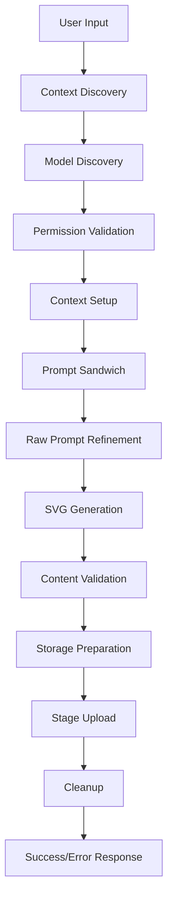
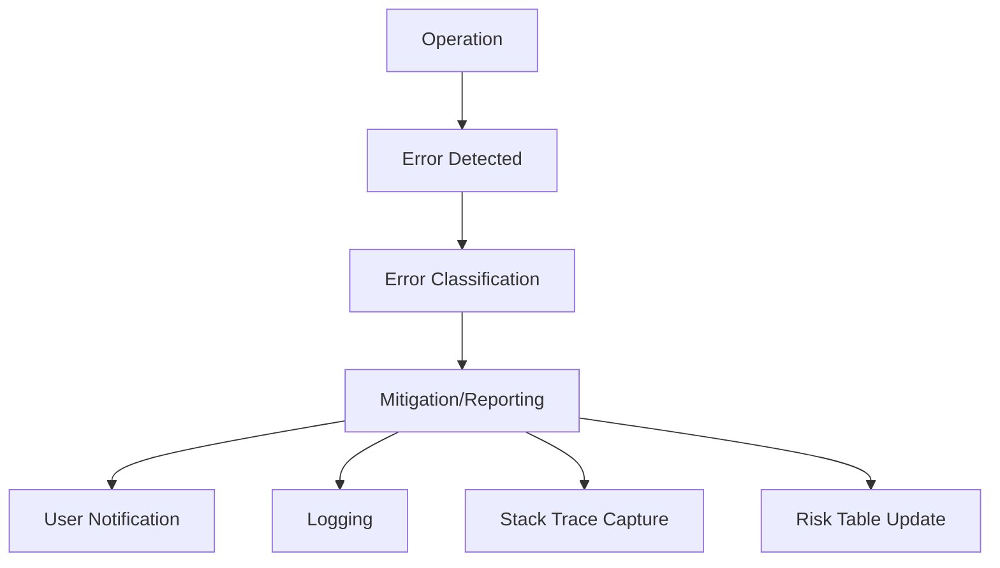
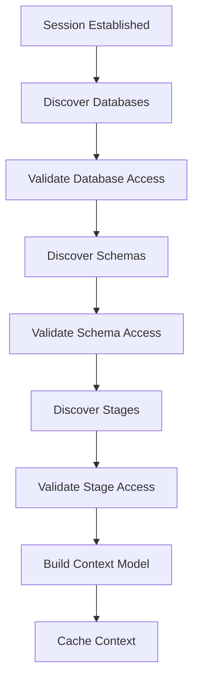
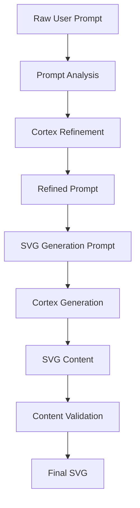

# Data Models for SVG Image Generation System

## Requirements Traceability, Risk Management, and Stakeholder Mapping

### 1. Requirements Traceability Matrix
| Requirement ID | Description | Code/Model Component | Status |
|---------------|-------------|----------------------|--------|
| REQ-1 | Only show user-accessible databases, schemas, and stages | discover_user_context, get_accessible_databases, get_accessible_schemas, get_accessible_stages | Implemented |
| REQ-2 | Prevent invalid model selection and runtime errors | get_available_cortex_models, validate_cortex_model, safe_cortex_call, UI model dropdown | Implemented |
| REQ-3 | Provide clear, actionable error messages for all runtime errors | safe_cortex_call, handle_context_errors, Streamlit error reporting | Implemented |
| REQ-4 | Log all errors and context for maintainers | logging in all error handling functions | Implemented |
| REQ-5 | Allow user to create new stages if needed | UI logic for stage creation | Implemented |
| REQ-6 | Support prompt sandwich approach for SVG generation | implement_prompt_sandwich, refine_prompt_with_cortex, generate_svg_with_refined_prompt | Implemented |
| REQ-7 | Ensure all requirements are testable and tested | tests/test_runtime_errors.py, tests/test_context_discovery.py | Implemented |
| REQ-8 | Document all requirements, risks, and stakeholder needs | ontologies/data_models.md, ontologies/functional_dependencies.md | Implemented |

### 2. Risk Management Table
| Risk ID | Description | Mitigation/Status | Accepted/Deferred |
|---------|-------------|-------------------|------------------|
| RISK-1 | User selects a model not available in Snowflake | Dynamic model discovery, validation before use, user feedback | Mitigated |
| RISK-2 | Permission errors for DB/schema/stage | Only show accessible resources, validate before use, clear error reporting | Mitigated |
| RISK-3 | Cortex service outage or timeout | Error handling, user feedback, logging | Mitigated |
| RISK-4 | Unclear error messages | All errors surfaced with actionable messages, logs for maintainers | Mitigated |
| RISK-5 | User confusion about available models | UI only shows available models, instructions updated | Mitigated |
| RISK-6 | Security: privilege escalation or data leak | Only show resources in user context, validate permissions | Mitigated |
| RISK-7 | Deferred: Full audit logging for compliance | Not yet implemented | Deferred |
| RISK-8 | Deferred: Automated recovery from service outages | Not yet implemented | Deferred |

### 3. Stakeholder Mapping
| Stakeholder | Perspective/Need | How Addressed |
|-------------|------------------|---------------|
| End User | Needs a simple, error-free UI that only shows what they can access | Dynamic dropdowns, error handling, clear instructions |
| Admin | Needs to ensure users can't access unauthorized resources | Context discovery, permission validation |
| Maintainer | Needs logs and error context for debugging | Logging, error reporting, test coverage |
| Security/Compliance | Needs to ensure no privilege escalation or data leaks | Context-aware resource discovery, permission checks |
| Developer | Needs requirements, risks, and flows to be documented and testable | Ontologies, traceability matrix, tests |

---

## Entity Relationship Model

### Core Entities

#### 1. User Session
```yaml
Entity: UserSession
Attributes:
  - session_id: UUID (Primary Key)
  - user_role: STRING
  - warehouse: STRING
  - database: STRING
  - schema: STRING
  - created_at: TIMESTAMP
  - last_activity: TIMESTAMP
  - is_active: BOOLEAN
```

#### 2. User Context
```yaml
Entity: UserContext
Attributes:
  - context_id: UUID (Primary Key)
  - session_id: UUID (Foreign Key -> UserSession)
  - user_role: STRING
  - warehouse: STRING
  - current_database: STRING
  - current_schema: STRING
  - accessible_databases: ARRAY<STRING>
  - accessible_schemas: ARRAY<STRING>
  - accessible_stages: ARRAY<STRING>
  - available_models: ARRAY<STRING>
  - cortex_access: BOOLEAN
  - permissions_level: ENUM('admin', 'user', 'readonly')
  - discovered_at: TIMESTAMP
  - last_validated: TIMESTAMP
```

#### 3. SVG Generation Request
```yaml
Entity: SVGGenerationRequest
Attributes:
  - request_id: UUID (Primary Key)
  - session_id: UUID (Foreign Key -> UserSession)
  - context_id: UUID (Foreign Key -> UserContext)
  - prompt_text: STRING
  - selected_model: STRING
  - filename: STRING
  - stage_name: STRING
  - database: STRING
  - schema: STRING
  - created_at: TIMESTAMP
  - status: ENUM('pending', 'processing', 'completed', 'failed')
  - error_message: STRING (nullable)
```

#### 4. Prompt Sandwich Session
```yaml
Entity: PromptSandwichSession
Attributes:
  - sandwich_id: UUID (Primary Key)
  - request_id: UUID (Foreign Key -> SVGGenerationRequest)
  - raw_prompt: STRING
  - refined_prompt: STRING
  - generation_prompt: STRING
  - model_used: STRING
  - refinement_time_ms: INTEGER
  - generation_time_ms: INTEGER
  - total_time_ms: INTEGER
  - refinement_success: BOOLEAN
  - generation_success: BOOLEAN
  - created_at: TIMESTAMP
```

#### 5. Error Event
```yaml
Entity: ErrorEvent
Attributes:
  - error_id: UUID (Primary Key)
  - session_id: UUID (Foreign Key -> UserSession)
  - context_id: UUID (Foreign Key -> UserContext)
  - error_type: STRING
  - error_message: STRING
  - error_code: STRING
  - occurred_at: TIMESTAMP
  - mitigated: BOOLEAN
  - user_visible: BOOLEAN
  - stack_trace: STRING (nullable)
```

#### 6. Generated SVG
```yaml
Entity: GeneratedSVG
Attributes:
  - svg_id: UUID (Primary Key)
  - request_id: UUID (Foreign Key -> SVGGenerationRequest)
  - sandwich_id: UUID (Foreign Key -> PromptSandwichSession)
  - svg_content: STRING (CLOB)
  - file_size: INTEGER
  - stage_path: STRING
  - generated_at: TIMESTAMP
  - model_used: STRING
  - processing_time_ms: INTEGER
```

#### 7. Snowflake Stage
```yaml
Entity: SnowflakeStage
Attributes:
  - stage_name: STRING (Primary Key)
  - database: STRING
  - schema: STRING
  - url: STRING
  - storage_integration: STRING (nullable)
  - encryption: STRING
  - created_at: TIMESTAMP
  - last_modified: TIMESTAMP
```

#### 8. Temporary Table
```yaml
Entity: TemporaryTable
Attributes:
  - table_name: STRING (Primary Key)
  - request_id: UUID (Foreign Key -> SVGGenerationRequest)
  - schema: STRING
  - created_at: TIMESTAMP
  - cleaned_up_at: TIMESTAMP (nullable)
  - table_type: ENUM('TRANSIENT', 'TEMPORARY')
```

#### 9. Context Discovery Log
```yaml
Entity: ContextDiscoveryLog
Attributes:
  - discovery_id: UUID (Primary Key)
  - session_id: UUID (Foreign Key -> UserSession)
  - discovery_type: ENUM('databases', 'schemas', 'stages', 'models', 'permissions')
  - target_database: STRING (nullable)
  - target_schema: STRING (nullable)
  - discovered_count: INTEGER
  - success: BOOLEAN
  - error_message: STRING (nullable)
  - discovery_time_ms: INTEGER
  - discovered_at: TIMESTAMP
```

## Data Flow Models

### 1. Enhanced SVG Generation Flow

```mermaid
graph TD
    A[User Input] --> B[Context Discovery]
    B --> C[Model Discovery]
    C --> D[Permission Validation]
    D --> E[Context Setup]
    E --> F[Prompt Sandwich]
    F --> G[Raw Prompt Refinement]
    G --> H[SVG Generation]
    H --> I[Content Validation]
    I --> J[Storage Preparation]
    J --> K[Stage Upload]
    K --> L[Cleanup]
    L --> M[Success/Error Response]
```

### 2. Error Handling Flow

```mermaid
graph TD
    A[Operation] --> B[Error Detected]
    B --> C[Error Classification]
    C --> D[Mitigation/Reporting]
    D --> E[User Notification]
    D --> F[Logging]
    D --> G[Stack Trace Capture]
    D --> H[Risk Table Update]
```

### 3. Context Discovery Flow

```mermaid
graph TD
    A[Session Established] --> B[Discover Databases]
    B --> C[Validate Database Access]
    C --> D[Discover Schemas]
    D --> E[Validate Schema Access]
    E --> F[Discover Stages]
    F --> G[Validate Stage Access]
    G --> H[Build Context Model]
    H --> I[Cache Context]
```

### 4. Prompt Sandwich Flow

```mermaid
graph TD
    A[Raw User Prompt] --> B[Prompt Analysis]
    B --> C[Cortex Refinement]
    C --> D[Refined Prompt]
    D --> E[SVG Generation Prompt]
    E --> F[Cortex Generation]
    F --> G[SVG Content]
    G --> H[Content Validation]
    H --> I[Final SVG]
```

### 5. Data Transformation Pipeline
```yaml
Pipeline: EnhancedSVGGenerationPipeline
Stages:
  1. Context Discovery:
     - User session validation
     - Database discovery
     - Schema discovery
     - Stage discovery
     - Permission validation
  2. Input Processing:
     - Text sanitization
     - Model validation
     - Filename generation
     - Context validation
  3. Prompt Sandwich Processing:
     - Raw prompt analysis
     - Cortex refinement
     - Generation prompt creation
     - AI processing
  4. Content Processing:
     - SVG extraction
     - Format validation
     - Size calculation
  5. Storage Processing:
     - Temporary table creation
     - Content insertion
     - Stage copy operation
  6. Cleanup:
     - Temporary table removal
     - Resource deallocation
```

## Schema Definitions

### 1. User Session Schema
```sql
CREATE OR REPLACE TABLE user_sessions (
    session_id STRING PRIMARY KEY,
    user_role STRING NOT NULL,
    warehouse STRING NOT NULL,
    database STRING,
    schema STRING,
    created_at TIMESTAMP_NTZ DEFAULT CURRENT_TIMESTAMP(),
    last_activity TIMESTAMP_NTZ DEFAULT CURRENT_TIMESTAMP(),
    is_active BOOLEAN DEFAULT TRUE
);
```

### 2. User Context Schema
```sql
CREATE OR REPLACE TABLE user_contexts (
    context_id STRING PRIMARY KEY,
    session_id STRING REFERENCES user_sessions(session_id),
    user_role STRING NOT NULL,
    warehouse STRING NOT NULL,
    current_database STRING,
    current_schema STRING,
    accessible_databases ARRAY,
    accessible_schemas ARRAY,
    accessible_stages ARRAY,
    cortex_access BOOLEAN DEFAULT FALSE,
    permissions_level STRING DEFAULT 'user',
    discovered_at TIMESTAMP_NTZ DEFAULT CURRENT_TIMESTAMP(),
    last_validated TIMESTAMP_NTZ DEFAULT CURRENT_TIMESTAMP(),
    CONSTRAINT valid_permissions_level CHECK (permissions_level IN ('admin', 'user', 'readonly'))
);
```

### 3. SVG Generation Requests Schema
```sql
CREATE OR REPLACE TABLE svg_generation_requests (
    request_id STRING PRIMARY KEY,
    session_id STRING REFERENCES user_sessions(session_id),
    context_id STRING REFERENCES user_contexts(context_id),
    prompt_text STRING NOT NULL,
    selected_model STRING NOT NULL,
    filename STRING NOT NULL,
    stage_name STRING NOT NULL,
    database STRING NOT NULL,
    schema STRING NOT NULL,
    created_at TIMESTAMP_NTZ DEFAULT CURRENT_TIMESTAMP(),
    status STRING DEFAULT 'pending',
    error_message STRING,
    CONSTRAINT valid_status CHECK (status IN ('pending', 'processing', 'completed', 'failed'))
);
```

### 4. Prompt Sandwich Sessions Schema
```sql
CREATE OR REPLACE TABLE prompt_sandwich_sessions (
    sandwich_id STRING PRIMARY KEY,
    request_id STRING REFERENCES svg_generation_requests(request_id),
    raw_prompt STRING NOT NULL,
    refined_prompt STRING NOT NULL,
    generation_prompt STRING NOT NULL,
    model_used STRING NOT NULL,
    refinement_time_ms INTEGER,
    generation_time_ms INTEGER,
    total_time_ms INTEGER,
    refinement_success BOOLEAN DEFAULT FALSE,
    generation_success BOOLEAN DEFAULT FALSE,
    created_at TIMESTAMP_NTZ DEFAULT CURRENT_TIMESTAMP(),
    CONSTRAINT positive_times CHECK (refinement_time_ms >= 0 AND generation_time_ms >= 0 AND total_time_ms >= 0)
);
```

### 5. Generated SVGs Schema
```sql
CREATE OR REPLACE TABLE generated_svgs (
    svg_id STRING PRIMARY KEY,
    request_id STRING REFERENCES svg_generation_requests(request_id),
    sandwich_id STRING REFERENCES prompt_sandwich_sessions(sandwich_id),
    svg_content STRING NOT NULL,
    file_size INTEGER NOT NULL,
    stage_path STRING NOT NULL,
    generated_at TIMESTAMP_NTZ DEFAULT CURRENT_TIMESTAMP(),
    model_used STRING NOT NULL,
    processing_time_ms INTEGER,
    CONSTRAINT positive_file_size CHECK (file_size > 0),
    CONSTRAINT positive_processing_time CHECK (processing_time_ms >= 0)
);
```

### 6. Context Discovery Log Schema
```sql
CREATE OR REPLACE TABLE context_discovery_logs (
    discovery_id STRING PRIMARY KEY,
    session_id STRING REFERENCES user_sessions(session_id),
    discovery_type STRING NOT NULL,
    target_database STRING,
    target_schema STRING,
    discovered_count INTEGER DEFAULT 0,
    success BOOLEAN DEFAULT FALSE,
    error_message STRING,
    discovery_time_ms INTEGER,
    discovered_at TIMESTAMP_NTZ DEFAULT CURRENT_TIMESTAMP(),
    CONSTRAINT valid_discovery_type CHECK (discovery_type IN ('databases', 'schemas', 'stages', 'permissions')),
    CONSTRAINT positive_discovery_count CHECK (discovered_count >= 0),
    CONSTRAINT positive_discovery_time CHECK (discovery_time_ms >= 0)
);
```

### 7. Temporary Tables Schema
```sql
CREATE OR REPLACE TABLE temporary_tables (
    table_name STRING PRIMARY KEY,
    request_id STRING REFERENCES svg_generation_requests(request_id),
    schema STRING NOT NULL,
    created_at TIMESTAMP_NTZ DEFAULT CURRENT_TIMESTAMP(),
    cleaned_up_at TIMESTAMP_NTZ,
    table_type STRING DEFAULT 'TRANSIENT',
    CONSTRAINT valid_table_type CHECK (table_type IN ('TRANSIENT', 'TEMPORARY'))
);
```

## Data Validation Rules

### 1. Input Validation
```yaml
Validation Rules:
  - prompt_text:
      - min_length: 10
      - max_length: 1000
      - required: true
      - pattern: "^[a-zA-Z0-9\\s\\-\\.\\,\\!\\?\\'\"]+$"

  - selected_model:
      - allowed_values: ["openai-gpt-4.1", "claude-4-sonnet", "claude-3-7-sonnet", "claude-3-5-sonnet"]
      - required: true

  - filename:
      - min_length: 1
      - max_length: 255
      - pattern: "^[a-zA-Z0-9\\_\\-]+$"
      - required: true

  - stage_name:
      - min_length: 1
      - max_length: 255
      - pattern: "^[a-zA-Z][a-zA-Z0-9\\_]*$"
      - required: true

  - database:
      - min_length: 1
      - max_length: 255
      - pattern: "^[a-zA-Z][a-zA-Z0-9\\_]*$"
      - required: true

  - schema:
      - min_length: 1
      - max_length: 255
      - pattern: "^[a-zA-Z][a-zA-Z0-9\\_]*$"
      - required: true
```

### 2. Context Validation
```yaml
Context Validation Rules:
  - accessible_databases:
      - min_count: 1
      - max_count: 1000
      - unique_values: true
      - valid_names: true

  - accessible_schemas:
      - min_count: 0
      - max_count: 1000
      - unique_values: true
      - valid_names: true

  - accessible_stages:
      - min_count: 0
      - max_count: 1000
      - unique_values: true
      - valid_names: true

  - permissions_level:
      - allowed_values: ["admin", "user", "readonly"]
      - required: true
```

### 3. Prompt Sandwich Validation
```yaml
Prompt Sandwich Validation:
  - raw_prompt:
      - min_length: 10
      - max_length: 1000
      - required: true

  - refined_prompt:
      - min_length: 10
      - max_length: 2000
      - required: true
      - svg_optimized: true

  - generation_prompt:
      - min_length: 50
      - max_length: 3000
      - required: true
      - contains_svg_instructions: true

  - processing_times:
      - refinement_time_ms: >= 0
      - generation_time_ms: >= 0
      - total_time_ms: >= 0
      - max_total_time: 300000  # 5 minutes
```

## Performance Optimization Strategies

### 1. Context Caching
```yaml
Caching Strategy:
  - Context Discovery Cache:
      - TTL: 300 seconds (5 minutes)
      - Invalidation: On session change
      - Storage: Session state
      - Scope: User session

  - Permission Cache:
      - TTL: 600 seconds (10 minutes)
      - Invalidation: On role change
      - Storage: Application cache
      - Scope: User role
```

### 2. Query Optimization
```yaml
Query Optimization:
  - Database Discovery:
      - Use SHOW DATABASES with LIMIT
      - Cache results for 5 minutes
      - Filter by user permissions

  - Schema Discovery:
      - Use SHOW SCHEMAS IN DATABASE
      - Cache per database
      - Lazy loading on demand

  - Stage Discovery:
      - Use SHOW STAGES IN SCHEMA
      - Cache per schema
      - Refresh on context change
```

### 3. Memory Management
```yaml
Memory Management:
  - SVG Content:
      - Max size: 10MB per SVG
      - Compression: GZIP for storage
      - Streaming: For large files

  - Context Data:
      - Max databases: 1000
      - Max schemas per database: 1000
      - Max stages per schema: 1000
      - Pagination: For large lists
```

## Security Considerations

### 1. Access Control
```yaml
Access Control:
  - Database Access:
      - Validate user permissions
      - Check role assignments
      - Audit access patterns

  - Schema Access:
      - Validate schema permissions
      - Check ownership
      - Monitor usage

  - Stage Access:
      - Validate stage permissions
      - Check CREATE/INSERT privileges
      - Audit file operations
```

### 2. Data Protection
```yaml
Data Protection:
  - Input Sanitization:
      - SQL injection prevention
      - XSS prevention
      - Path traversal prevention

  - Output Encoding:
      - HTML encoding
      - URL encoding
      - JSON encoding

  - Temporary Data:
      - Automatic cleanup
      - Secure deletion
      - Access logging
```

### 3. Audit Trail
```yaml
Audit Trail:
  - User Actions:
      - Context discovery
      - SVG generation
      - File uploads
      - Error conditions

  - System Events:
      - Authentication
      - Authorization
      - Resource access
      - Performance metrics
```

## Error Handling Models

### 1. Context Discovery Errors
```yaml
Context Discovery Error Types:
  - Permission Denied:
      - Error Code: CONTEXT_001
      - Severity: HIGH
      - Action: Stop execution
      - User Message: "Insufficient permissions"

  - Resource Not Found:
      - Error Code: CONTEXT_002
      - Severity: MEDIUM
      - Action: Skip resource
      - User Message: "Resource not accessible"

  - Network Timeout:
      - Error Code: CONTEXT_003
      - Severity: MEDIUM
      - Action: Retry with backoff
      - User Message: "Connection timeout"
```

### 2. Prompt Sandwich Errors
```yaml
Prompt Sandwich Error Types:
  - Refinement Failure:
      - Error Code: SANDWICH_001
      - Severity: MEDIUM
      - Action: Use original prompt
      - User Message: "Using original prompt"

  - Generation Failure:
      - Error Code: SANDWICH_002
      - Severity: HIGH
      - Action: Stop execution
      - User Message: "SVG generation failed"

  - Model Unavailable:
      - Error Code: SANDWICH_003
      - Severity: HIGH
      - Action: Suggest alternative
      - User Message: "Model not available"
```

### 3. Storage Errors
```yaml
Storage Error Types:
  - Stage Creation Failure:
      - Error Code: STORAGE_001
      - Severity: HIGH
      - Action: Stop execution
      - User Message: "Cannot create stage"

  - Upload Failure:
      - Error Code: STORAGE_002
      - Severity: HIGH
      - Action: Retry upload
      - User Message: "Upload failed"

  - Cleanup Failure:
      - Error Code: STORAGE_003
      - Severity: LOW
      - Action: Log and continue
      - User Message: "Cleanup warning"
```

## Monitoring and Metrics

### 1. Performance Metrics
```yaml
Performance Metrics:
  - Context Discovery:
      - Discovery time per resource type
      - Success rate per resource type
      - Cache hit rate
      - Error rate

  - Prompt Sandwich:
      - Refinement time
      - Generation time
      - Success rate
      - Quality metrics

  - Storage Operations:
      - Upload time
      - File size distribution
      - Success rate
      - Cleanup time
```

### 2. Business Metrics
```yaml
Business Metrics:
  - User Engagement:
      - Active sessions
      - SVG generations per session
      - Context switches
      - Error frequency

  - Resource Usage:
      - Database access patterns
      - Schema usage
      - Stage utilization
      - Model preferences
```

### 3. Error Metrics
```yaml
Error Metrics:
  - Error Distribution:
      - Error types by frequency
      - Error severity distribution
      - Error resolution time
      - User impact assessment

  - Recovery Metrics:
      - Automatic recovery rate
      - Manual intervention rate
      - Mean time to resolution
      - User satisfaction impact
```

This comprehensive data model structure ensures proper data organization, validation, and management across all system components and development workflows.
