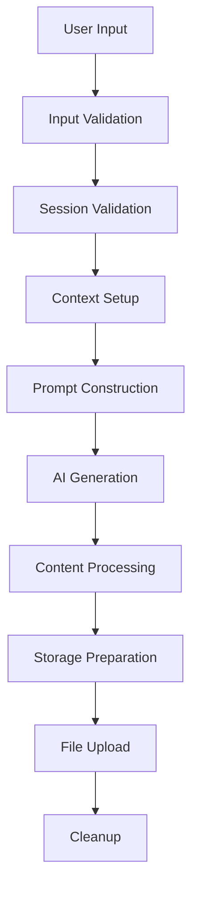
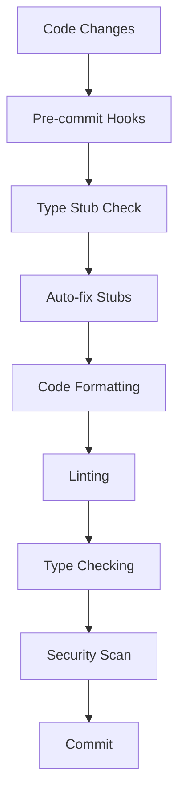

# Functional Dependencies for SVG Image Generation System

## System Functional Dependencies

### 1. Core Functional Dependencies

#### A. Session Management Dependencies
```yaml
Function: get_session()
Dependencies:
  - snowflake-snowpark-python package
  - Active Snowflake connection (SiS environment)
  - OR environment variables (local development)
  - python-dotenv package (local development)
  - Valid user credentials
  - Network connectivity to Snowflake
  - Streamlit cache_resource decorator
Output: Snowflake session object
Error Handling: Connection failure, authentication errors, missing environment variables
```

#### B. Context Management Dependencies
```yaml
Function: use_context()
Dependencies:
  - Valid Snowflake session
  - Database existence (if specified)
  - Schema existence (if specified)
  - User permissions for database/schema
  - SQL execution capabilities
Output: Boolean success status
Error Handling: Invalid context, permission errors
```

#### C. SVG Generation Dependencies
```yaml
Function: generate_svg_content()
Dependencies:
  - Valid prompt text
  - Selected AI model availability
  - Cortex AI service access
  - Snowflake warehouse running
  - SQL execution permissions
  - Network connectivity
Output: SVG content string
Error Handling: AI service errors, timeout, invalid responses
```

### 2. Development Workflow Dependencies

#### A. Type Stub Management Dependencies
```yaml
Function: fix_missing_type_stubs()
Dependencies:
  - mypy package
  - Python executable
  - requirements-dev.txt file
  - Comprehensive package mapping
  - Subprocess execution capabilities
  - File system write permissions
Output: Updated requirements-dev.txt, installed stubs
Error Handling: Missing packages, installation failures, mapping errors
```

#### B. Pre-commit Hook Dependencies
```yaml
Function: pre_commit_hooks()
Dependencies:
  - pre-commit package
  - Git repository
  - All development tools (black, ruff, mypy, etc.)
  - Type stub management script
  - File system access
Output: Clean commits, formatted code, type safety
Error Handling: Hook failures, tool errors, configuration issues
```

#### C. Environment Management Dependencies
```yaml
Function: environment_setup()
Dependencies:
  - python-dotenv package (local development)
  - Environment variable configuration
  - Snowflake credentials (local development)
  - Network connectivity
  - File system permissions
Output: Configured development environment
Error Handling: Missing credentials, network issues, permission errors
```

### 3. Data Flow Dependencies

#### A. Input Processing Chain


#### B. Development Workflow Chain


#### C. Error Handling Dependencies
```yaml
Error Chain:
  - Input Validation Errors:
      - Invalid prompt text
      - Invalid model selection
      - Invalid filename format
      - Invalid stage name

  - Session Errors:
      - Connection failure
      - Authentication failure
      - Session timeout
      - Permission denied
      - Missing environment variables

  - AI Generation Errors:
      - Cortex service unavailable
      - Model not available
      - Generation timeout
      - Invalid response format

  - Storage Errors:
      - Stage creation failure
      - File upload failure
      - Temporary table errors
      - Cleanup failures

  - Development Errors:
      - Missing type stubs
      - Pre-commit hook failures
      - Environment configuration issues
      - Dependency installation problems
```

## Component Dependencies

### 1. Frontend Component Dependencies

#### A. Streamlit UI Components
```yaml
Page Configuration:
  - streamlit package
  - Page title and icon
  - Layout configuration
  - Session state management

Sidebar Components:
  - Stage name input
  - Database/schema inputs
  - Configuration validation
  - User feedback

Main Interface:
  - Text area for prompts
  - Model selection dropdown
  - File naming interface
  - Generation button
  - Progress indicators
  - Result display
```

#### B. UI State Management
```yaml
State Dependencies:
  - Session state persistence
  - Form validation state
  - Loading state management
  - Error state handling
  - Success state display
  - Cache invalidation
```

### 2. Backend Component Dependencies

#### A. Snowflake Integration Layer
```yaml
Session Management:
  - Connection pooling
  - Authentication handling
  - Session lifecycle management
  - Error recovery
  - Resource cleanup

SQL Operations:
  - Query execution
  - Result processing
  - Transaction management
  - Error handling
  - Performance optimization
```

#### B. File Operations Layer
```yaml
Stage Management:
  - Stage creation
  - File upload/download
  - Metadata tracking
  - Access control
  - Cleanup operations

Temporary Storage:
  - Table creation
  - Data insertion
  - Content validation
  - Resource cleanup
  - Error recovery
```

### 3. Development Tools Dependencies

#### A. Type Checking System
```yaml
Mypy Integration:
  - mypy package
  - Type stub packages (types-*)
  - Configuration files
  - Pre-commit integration
  - IDE integration

Stub Management:
  - Automatic detection script
  - Package mapping system
  - Requirements file management
  - Installation automation
  - Error handling
```

#### B. Code Quality Tools
```yaml
Formatting Tools:
  - black (code formatter)
  - isort (import sorter)
  - ruff (fast linter)
  - flake8 (style checker)

Security Tools:
  - bandit (security linter)
  - safety (vulnerability scanner)
  - Pre-commit hooks
  - CI/CD integration
```

### 4. AI Integration Dependencies

#### A. Cortex AI Service
```yaml
Model Selection:
  - Available model list
  - Model capabilities
  - Performance characteristics
  - Cost considerations
  - Error handling

Prompt Engineering:
  - Input sanitization
  - Prompt construction
  - Context management
  - Response parsing
  - Validation
```

## Functional Workflows

### 1. Primary Generation Workflow
```yaml
Workflow: SVG_Generation_Main
Steps:
  1. User Input Collection:
     - Validate prompt text
     - Validate model selection
     - Validate filename
     - Validate stage name

  2. Session Preparation:
     - Get active session (SiS) or create session (local)
     - Validate session state
     - Switch context if needed

  3. AI Generation:
     - Construct Cortex prompt
     - Execute AI query
     - Parse response
     - Validate SVG content

  4. Storage Operations:
     - Create stage if needed
     - Create temporary table
     - Insert SVG content
     - Copy to stage
     - Clean up temporary resources

  5. Result Delivery:
     - Display preview
     - Provide download instructions
     - Show success message
     - Log metrics
```

### 2. Development Workflow
```yaml
Workflow: Development_Process
Steps:
  1. Code Changes:
     - Make code modifications
     - Follow coding standards
     - Add type annotations
     - Write tests

  2. Pre-commit Processing:
     - Run type stub management
     - Format code automatically
     - Run linting checks
     - Execute type checking
     - Perform security scans

  3. Testing:
     - Run unit tests
     - Execute integration tests
     - Check test coverage
     - Validate functionality

  4. Documentation:
     - Update README if needed
     - Update CONTRIBUTING.md
     - Update ontology files
     - Review API documentation

  5. Commit and Push:
     - Create meaningful commit message
     - Push to feature branch
     - Create pull request
     - Address review feedback
```

### 3. Type Stub Management Workflow
```yaml
Workflow: Type_Stub_Management
Steps:
  1. Detection:
     - Run mypy on codebase
     - Parse output for missing stubs
     - Identify package names
     - Map to typeshed equivalents

  2. Resolution:
     - Check existing requirements
     - Add missing stubs
     - Handle special cases
     - Skip built-in modules

  3. Installation:
     - Install new stubs
     - Verify installation
     - Test compatibility
     - Update documentation

  4. Validation:
     - Re-run mypy
     - Confirm errors resolved
     - Check for new issues
     - Update package mapping if needed
```

### 4. Error Recovery Workflow
```yaml
Workflow: Error_Recovery
Steps:
  1. Error Detection:
     - Identify error type
     - Capture error context
     - Log error details

  2. Error Classification:
     - Session errors
     - AI service errors
     - Storage errors
     - Validation errors
     - Development tool errors

  3. Recovery Actions:
     - Retry logic
     - Fallback options
     - Resource cleanup
     - User notification

  4. State Recovery:
     - Restore UI state
     - Clear error conditions
     - Reset form data
     - Update status
```

### 5. Cleanup Workflow
```yaml
Workflow: Resource_Cleanup
Steps:
  1. Temporary Resource Identification:
     - Temporary tables
     - Cached data
     - Session resources
     - File handles

  2. Cleanup Execution:
     - Drop temporary tables
     - Clear caches
     - Release connections
     - Remove temporary files

  3. Verification:
     - Confirm cleanup success
     - Log cleanup actions
     - Update resource tracking
     - Error handling
```

## Dependency Injection Patterns

### 1. Service Dependencies
```python
# Session service dependency
@st.cache_resource
def get_session_service():
    return SessionService()

# AI service dependency
def get_ai_service(session):
    return AIService(session)

# Storage service dependency
def get_storage_service(session):
    return StorageService(session)

# Type stub management service
def get_stub_manager():
    return StubManager()
```

### 2. Configuration Dependencies
```yaml
Configuration Dependencies:
  - Environment variables
  - Snowflake connection parameters
  - AI model configurations
  - Storage settings
  - UI preferences
  - Error handling policies
  - Development tool configurations
  - Type stub mappings
```

### 3. External Service Dependencies
```yaml
External Services:
  - Snowflake Data Platform:
      - Authentication service
      - SQL execution engine
      - File storage service
      - AI service (Cortex)

  - Streamlit Platform:
      - Web server
      - Session management
      - UI rendering
      - File handling

  - Development Tools:
      - PyPI (package installation)
      - Typeshed (type stubs)
      - Pre-commit hooks
      - CI/CD services
```

## Performance Dependencies

### 1. Caching Dependencies
```yaml
Cache Dependencies:
  - Session caching:
      - Cache key: user session
      - TTL: 1 hour
      - Invalidation: session timeout

  - Data caching:
      - Cache key: stage contents
      - TTL: 1 hour
      - Invalidation: manual refresh

  - Configuration caching:
      - Cache key: app configuration
      - TTL: 24 hours
      - Invalidation: config changes

  - Type stub caching:
      - Cache key: mypy results
      - TTL: 1 hour
      - Invalidation: requirements changes
```

### 2. Resource Management Dependencies
```yaml
Resource Dependencies:
  - Memory management:
      - Temporary data cleanup
      - Result set limiting
      - Connection pooling

  - CPU management:
      - Async operations
      - Background processing
      - Load balancing

  - Network management:
      - Connection pooling
      - Retry logic
      - Timeout handling

  - Development resources:
      - Type checking optimization
      - Pre-commit hook efficiency
      - Dependency resolution speed
```

## Security Dependencies

### 1. Authentication Dependencies
```yaml
Auth Dependencies:
  - Snowflake authentication:
      - User credentials
      - Role permissions
      - Session tokens
      - Token refresh

  - Application security:
      - Input validation
      - SQL injection prevention
      - XSS protection
      - CSRF protection

  - Development security:
      - Dependency vulnerability scanning
      - Code security analysis
      - Environment variable protection
      - Credential management
```

### 2. Authorization Dependencies
```yaml
Authorization Dependencies:
  - Role-based access:
      - Database access
      - Schema access
      - Stage permissions
      - AI service access

  - Resource permissions:
      - Table creation
      - File upload
      - Stage management
      - Query execution

  - Development permissions:
      - Package installation
      - File system access
      - Git operations
      - CI/CD access
```

## Monitoring Dependencies

### 1. Logging Dependencies
```yaml
Logging Dependencies:
  - Application logs:
      - User actions
      - System events
      - Error conditions
      - Performance metrics

  - Audit logs:
      - Authentication events
      - Authorization checks
      - Data access
      - Configuration changes

  - Development logs:
      - Type checking results
      - Pre-commit hook execution
      - Dependency management
      - Build processes
```

### 2. Metrics Dependencies
```yaml
Metrics Dependencies:
  - Performance metrics:
      - Response times
      - Throughput
      - Error rates
      - Resource usage

  - Business metrics:
      - Generation success rate
      - User engagement
      - Feature usage
      - Quality metrics

  - Development metrics:
      - Type coverage
      - Code quality scores
      - Build times
      - Test coverage
```

## Testing Dependencies

### 1. Unit Test Dependencies
```yaml
Unit Test Dependencies:
  - Test frameworks:
      - pytest
      - unittest
      - mock libraries

  - Test data:
      - Mock responses
      - Test fixtures
      - Sample SVGs
      - Error scenarios

  - Type checking:
      - Type stub validation
      - Type annotation testing
      - Mock type checking
```

### 2. Integration Test Dependencies
```yaml
Integration Test Dependencies:
  - Test environment:
      - Snowflake test account
      - Test data setup
      - Cleanup procedures

  - Test scenarios:
      - End-to-end workflows
      - Error conditions
      - Performance tests
      - Security tests

  - Development integration:
      - Pre-commit hook testing
      - Type stub management testing
      - CI/CD pipeline testing
```

## Deployment Dependencies

### 1. Infrastructure Dependencies
```yaml
Infrastructure Dependencies:
  - Runtime environment:
      - Python 3.8+
      - Required packages
      - System libraries

  - Network connectivity:
      - Snowflake API access
      - HTTPS support
      - DNS resolution

  - Storage requirements:
      - Temporary file space
      - Log storage
      - Configuration storage

  - Development infrastructure:
      - Git repository
      - CI/CD pipeline
      - Package registry access
      - Documentation hosting
```

### 2. Configuration Dependencies
```yaml
Configuration Dependencies:
  - Environment variables:
      - Connection parameters
      - Feature flags
      - Logging levels

  - Configuration files:
      - Application settings
      - Model configurations
      - UI preferences
      - Error policies

  - Development configuration:
      - Pre-commit hooks
      - Type checking settings
      - Linting rules
      - Test configurations
```

This comprehensive dependency management system ensures reliable, secure, and maintainable development with automated type safety and quality assurance.
