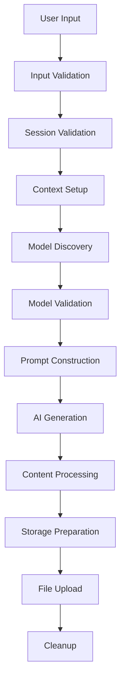
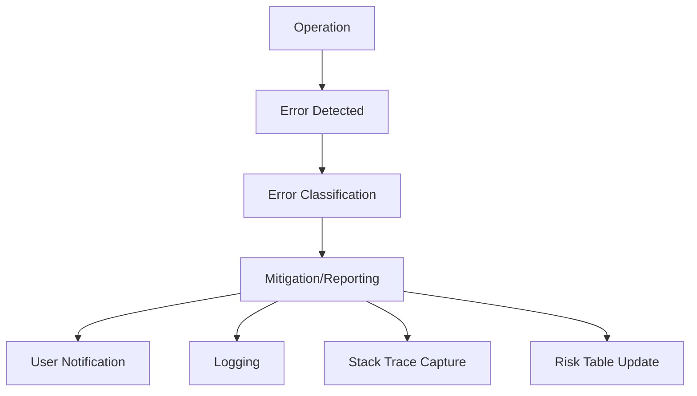
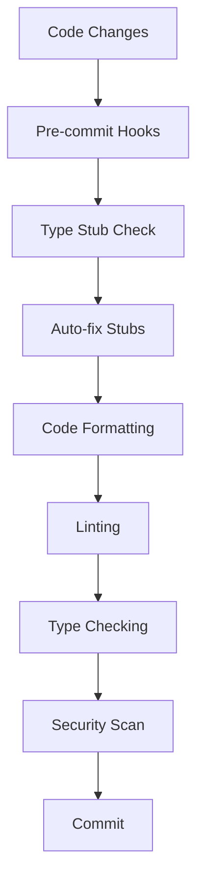

# Functional Dependencies for SVG Image Generation System

## Requirements Traceability, Risk Management, and Stakeholder Mapping

### 1. Requirements Traceability Matrix
| Requirement ID | Description | Code/Model Component | Status |
|---------------|-------------|----------------------|--------|
| REQ-1 | Only show user-accessible databases, schemas, and stages | discover_user_context, get_accessible_databases, get_accessible_schemas, get_accessible_stages | Implemented |
| REQ-2 | Prevent invalid model selection and runtime errors | get_available_cortex_models, validate_cortex_model, safe_cortex_call, UI model dropdown | Implemented |
| REQ-3 | Provide clear, actionable error messages for all runtime errors | safe_cortex_call, handle_context_errors, Streamlit error reporting | Implemented |
| REQ-4 | Log all errors and context for maintainers | logging in all error handling functions | Implemented |
| REQ-5 | Allow user to create new stages if needed | UI logic for stage creation | Implemented |
| REQ-6 | Support prompt sandwich approach for SVG generation | implement_prompt_sandwich, refine_prompt_with_cortex, generate_svg_with_refined_prompt | Implemented |
| REQ-7 | Ensure all requirements are testable and tested | tests/test_runtime_errors.py, tests/test_context_discovery.py | Implemented |
| REQ-8 | Document all requirements, risks, and stakeholder needs | ontologies/data_models.md, ontologies/functional_dependencies.md | Implemented |

### 2. Risk Management Table
| Risk ID | Description | Mitigation/Status | Accepted/Deferred |
|---------|-------------|-------------------|------------------|
| RISK-1 | User selects a model not available in Snowflake | Dynamic model discovery, validation before use, user feedback | Mitigated |
| RISK-2 | Permission errors for DB/schema/stage | Only show accessible resources, validate before use, clear error reporting | Mitigated |
| RISK-3 | Cortex service outage or timeout | Error handling, user feedback, logging | Mitigated |
| RISK-4 | Unclear error messages | All errors surfaced with actionable messages, logs for maintainers | Mitigated |
| RISK-5 | User confusion about available models | UI only shows available models, instructions updated | Mitigated |
| RISK-6 | Security: privilege escalation or data leak | Only show resources in user context, validate permissions | Mitigated |
| RISK-7 | Deferred: Full audit logging for compliance | Not yet implemented | Deferred |
| RISK-8 | Deferred: Automated recovery from service outages | Not yet implemented | Deferred |

### 3. Stakeholder Mapping
| Stakeholder | Perspective/Need | How Addressed |
|-------------|------------------|---------------|
| End User | Needs a simple, error-free UI that only shows what they can access | Dynamic dropdowns, error handling, clear instructions |
| Admin | Needs to ensure users can't access unauthorized resources | Context discovery, permission validation |
| Maintainer | Needs logs and error context for debugging | Logging, error reporting, test coverage |
| Security/Compliance | Needs to ensure no privilege escalation or data leaks | Context-aware resource discovery, permission checks |
| Developer | Needs requirements, risks, and flows to be documented and testable | Ontologies, traceability matrix, tests |

---

## System Functional Dependencies

### 1. Core Functional Dependencies

#### A. Session Management Dependencies
```yaml
Function: get_session()
Dependencies:
  - snowflake-snowpark-python package
  - Three-tier authentication system:
    1. Active Snowflake connection (SiS environment) - get_active_session()
    2. Connection parameters (various Snowflake environments) - Session.builder.create()
    3. Environment variables (local development) - Session.builder.configs()
  - python-dotenv package (local development)
  - Valid user credentials
  - Network connectivity to Snowflake
  - Streamlit cache_resource decorator
Output: Snowflake session object
Error Handling: Connection failure, authentication errors, missing environment variables
Authentication Flow:
  1. Try get_active_session() for SiS environment
  2. Try Session.builder.create() for connection parameter environments
  3. Try Session.builder.configs() with environment variables for local development
```

#### B. Context Management Dependencies
```yaml
Function: use_context()
Dependencies:
  - Valid Snowflake session
  - Database existence (if specified)
  - Schema existence (if specified)
  - User permissions for database/schema
  - SQL execution capabilities
Output: Boolean success status
Error Handling: Invalid context, permission errors
```

#### C. Model Discovery and Validation Dependencies
```yaml
Function: get_available_cortex_models(), validate_cortex_model()
Dependencies:
  - Valid Snowflake session
  - Cortex AI service enabled
  - User permissions for Cortex models
  - Model registry or test queries
Output: List of available models, Boolean validation result
Error Handling: Unknown model, permission errors, service errors, timeouts
```

#### D. SVG Generation Dependencies
```yaml
Function: generate_svg_content(), implement_prompt_sandwich(), safe_cortex_call()
Dependencies:
  - Valid prompt text
  - Selected AI model availability (validated)
  - Cortex AI service access
  - Snowflake warehouse running
  - SQL execution permissions
  - Network connectivity
Output: SVG content string
Error Handling: AI service errors, timeout, invalid responses, model errors
```

#### E. Error Handling and Logging Dependencies
```yaml
Function: handle_context_errors(), safe_cortex_call(), logging
Dependencies:
  - All core functions
  - Error classification logic
  - Logging configuration
  - Streamlit error reporting
Output: User-facing error messages, logs, stack traces
Error Handling: All known and unknown error cases
```

### 2. Development Workflow Dependencies

#### A. Type Stub Management Dependencies
```yaml
Function: fix_missing_type_stubs()
Dependencies:
  - mypy package
  - Python executable
  - requirements-dev.txt file
  - Comprehensive package mapping
  - Subprocess execution capabilities
  - File system write permissions
Output: Updated requirements-dev.txt, installed stubs
Error Handling: Missing packages, installation failures, mapping errors
```

#### B. Pre-commit Hook Dependencies
```yaml
Function: pre_commit_hooks()
Dependencies:
  - pre-commit package
  - Git repository
  - All development tools (black, ruff, mypy, etc.)
  - Type stub management script
  - File system access
Output: Clean commits, formatted code, type safety
Error Handling: Hook failures, tool errors, configuration issues
```

#### C. Environment Management Dependencies
```yaml
Function: environment_setup()
Dependencies:
  - python-dotenv package (local development)
  - Environment variable configuration
  - Snowflake credentials (local development)
  - Network connectivity
  - File system permissions
Output: Configured development environment
Error Handling: Missing credentials, network issues, permission errors
```

### 3. Data Flow Dependencies

#### A. Input Processing Chain

```mermaid
graph TD
    A[User Input] --> B[Input Validation]
    B --> C[Session Validation]
    C --> D[Context Setup]
    D --> E[Model Discovery]
    E --> F[Model Validation]
    F --> G[Prompt Construction]
    G --> H[AI Generation]
    H --> I[Content Processing]
    I --> J[Storage Preparation]
    J --> K[File Upload]
    K --> L[Cleanup]
```

#### B. Error Handling Chain

```mermaid
graph TD
    A[Operation] --> B[Error Detected]
    B --> C[Error Classification]
    C --> D[Mitigation/Reporting]
    D --> E[User Notification]
    D --> F[Logging]
    D --> G[Stack Trace Capture]
    D --> H[Risk Table Update]
```

#### C. Development Workflow Chain

```mermaid
graph TD
    A[Code Changes] --> B[Pre-commit Hooks]
    B --> C[Type Stub Check]
    C --> D[Auto-fix Stubs]
    D --> E[Code Formatting]
    E --> F[Linting]
    F --> G[Type Checking]
    G --> H[Security Scan]
    H --> I[Commit]
```

---

## Component Dependencies

### 1. Frontend Component Dependencies

#### A. Streamlit UI Components
```yaml
Page Configuration:
  - streamlit package
  - Page title and icon
  - Layout configuration
  - Session state management

Sidebar Components:
  - Stage name input
  - Database/schema inputs (dynamic dropdowns)
  - Model selection dropdown (dynamic, validated)
  - Configuration validation
  - User feedback

Main Interface:
  - Text area for prompts
  - Model selection dropdown
  - File naming interface
  - Generation button
  - Progress indicators
  - Result display
  - Error reporting
```

#### B. UI State Management
```yaml
State Dependencies:
  - Session state persistence
  - Form validation state
  - Loading state management
  - Error state handling
  - Success state display
  - Cache invalidation
```

### 2. Backend Component Dependencies

#### A. Context Discovery and Model Validation
```yaml
Backend Dependencies:
  - discover_user_context()
  - get_available_cortex_models()
  - validate_cortex_model()
  - get_accessible_databases(), get_accessible_schemas(), get_accessible_stages()
  - Logging and error handling
```

#### B. Prompt Sandwich and SVG Generation
```yaml
Backend Dependencies:
  - implement_prompt_sandwich()
  - refine_prompt_with_cortex()
  - generate_svg_with_refined_prompt()
  - safe_cortex_call()
  - Error handling and logging
```

#### C. Error Handling and Logging
```yaml
Backend Dependencies:
  - handle_context_errors()
  - Logging configuration
  - User feedback via Streamlit
  - Stack trace capture
  - Risk table update
```

### 3. Development Tools Dependencies

#### A. Type Checking System
```yaml
Mypy Integration:
  - mypy package
  - Type stub packages (types-*)
  - Configuration files
  - Pre-commit integration
  - IDE integration

Stub Management:
  - Automatic detection script
  - Package mapping system
  - Requirements file management
  - Installation automation
  - Error handling
```

#### B. Code Quality Tools
```yaml
Formatting Tools:
  - black (code formatter)
  - isort (import sorter)
  - ruff (fast linter)
  - flake8 (style checker)

Security Tools:
  - bandit (security linter)
  - safety (vulnerability scanner)
  - Pre-commit hooks
  - CI/CD integration
```

### 4. AI Integration Dependencies

#### A. Cortex AI Service
```yaml
Model Selection:
  - Available model list
  - Model capabilities
  - Performance characteristics
  - Cost considerations
  - Error handling

Prompt Engineering:
  - Input sanitization
  - Prompt construction
  - Context management
  - Response parsing
  - Validation
```

## Functional Workflows

### 1. Primary Generation Workflow
```yaml
Workflow: SVG_Generation_Main
Steps:
  1. User Input Collection:
     - Validate prompt text
     - Validate model selection
     - Validate filename
     - Validate stage name

  2. Session Preparation:
     - Get active session (SiS) or create session (local)
     - Validate session state
     - Switch context if needed

  3. AI Generation:
     - Construct Cortex prompt
     - Execute AI query
     - Parse response
     - Validate SVG content

  4. Storage Operations:
     - Create stage if needed
     - Create temporary table
     - Insert SVG content
     - Copy to stage
     - Clean up temporary resources

  5. Result Delivery:
     - Display preview
     - Provide download instructions
     - Show success message
     - Log metrics
```

### 2. Development Workflow
```yaml
Workflow: Development_Process
Steps:
  1. Code Changes:
     - Make code modifications
     - Follow coding standards
     - Add type annotations
     - Write tests

  2. Pre-commit Processing:
     - Run type stub management
     - Format code automatically
     - Run linting checks
     - Execute type checking
     - Perform security scans

  3. Testing:
     - Run unit tests
     - Execute integration tests
     - Check test coverage
     - Validate functionality

  4. Documentation:
     - Update README if needed
     - Update CONTRIBUTING.md
     - Update ontology files
     - Review API documentation

  5. Commit and Push:
     - Create meaningful commit message
     - Push to feature branch
     - Create pull request
     - Address review feedback
```

### 3. Type Stub Management Workflow
```yaml
Workflow: Type_Stub_Management
Steps:
  1. Detection:
     - Run mypy on codebase
     - Parse output for missing stubs
     - Identify package names
     - Map to typeshed equivalents

  2. Resolution:
     - Check existing requirements
     - Add missing stubs
     - Handle special cases
     - Skip built-in modules

  3. Installation:
     - Install new stubs
     - Verify installation
     - Test compatibility
     - Update documentation

  4. Validation:
     - Re-run mypy
     - Confirm errors resolved
     - Check for new issues
     - Update package mapping if needed
```

### 4. Error Recovery Workflow
```yaml
Workflow: Error_Recovery
Steps:
  1. Error Detection:
     - Identify error type
     - Capture error context
     - Log error details

  2. Error Classification:
     - Session errors
     - AI service errors
     - Storage errors
     - Validation errors
     - Development tool errors

  3. Recovery Actions:
     - Retry logic
     - Fallback options
     - Resource cleanup
     - User notification

  4. State Recovery:
     - Restore UI state
     - Clear error conditions
     - Reset form data
     - Update status
```

### 5. Cleanup Workflow
```yaml
Workflow: Resource_Cleanup
Steps:
  1. Temporary Resource Identification:
     - Temporary tables
     - Cached data
     - Session resources
     - File handles

  2. Cleanup Execution:
     - Drop temporary tables
     - Clear caches
     - Release connections
     - Remove temporary files

  3. Verification:
     - Confirm cleanup success
     - Log cleanup actions
     - Update resource tracking
     - Error handling
```

## Dependency Injection Patterns

### 1. Service Dependencies
```python
# Session service dependency
@st.cache_resource
def get_session_service():
    return SessionService()

# AI service dependency
def get_ai_service(session):
    return AIService(session)

# Storage service dependency
def get_storage_service(session):
    return StorageService(session)

# Type stub management service
def get_stub_manager():
    return StubManager()
```

### 2. Configuration Dependencies
```yaml
Configuration Dependencies:
  - Environment variables
  - Snowflake connection parameters
  - AI model configurations
  - Storage settings
  - UI preferences
  - Error handling policies
  - Development tool configurations
  - Type stub mappings
```

### 3. External Service Dependencies
```yaml
External Services:
  - Snowflake Data Platform:
      - Authentication service
      - SQL execution engine
      - File storage service
      - AI service (Cortex)

  - Streamlit Platform:
      - Web server
      - Session management
      - UI rendering
      - File handling

  - Development Tools:
      - PyPI (package installation)
      - Typeshed (type stubs)
      - Pre-commit hooks
      - CI/CD services
```

## Performance Dependencies

### 1. Caching Dependencies
```yaml
Cache Dependencies:
  - Session caching:
      - Cache key: user session
      - TTL: 1 hour
      - Invalidation: session timeout

  - Data caching:
      - Cache key: stage contents
      - TTL: 1 hour
      - Invalidation: manual refresh

  - Configuration caching:
      - Cache key: app configuration
      - TTL: 24 hours
      - Invalidation: config changes

  - Type stub caching:
      - Cache key: mypy results
      - TTL: 1 hour
      - Invalidation: requirements changes
```

### 2. Resource Management Dependencies
```yaml
Resource Dependencies:
  - Memory management:
      - Temporary data cleanup
      - Result set limiting
      - Connection pooling

  - CPU management:
      - Async operations
      - Background processing
      - Load balancing

  - Network management:
      - Connection pooling
      - Retry logic
      - Timeout handling

  - Development resources:
      - Type checking optimization
      - Pre-commit hook efficiency
      - Dependency resolution speed
```

## Security Dependencies

### 1. Authentication Dependencies

#### Three-Tier Authentication System

The application implements a robust three-tier authentication system with automatic fallback:

1. **Tier 1: Active Session (Streamlit in Snowflake)**
   - Primary method for SiS environments
   - Uses `get_active_session()` from Snowpark
   - Inherits current Snowflake context

2. **Tier 2: Connection Parameters (connections.toml)**
   - Secondary method for local development
   - Parses `~/.snowflake/connections.toml` manually
   - Handles both `[default]` and `[connections.default]` structures
   - **Critical: Private Key Authentication Support**
     - Detects `private_key_path` in configuration
     - Reads and loads private key file content
     - Converts path to actual key object for Snowpark
     - Handles optional passphrase for encrypted keys
     - Common error: `Expected bytes or RSAPrivateKey, got <class 'NoneType'>` when path is passed instead of content

3. **Tier 3: Environment Variables**
   - Fallback method for explicit configuration
   - Requires manual setup of environment variables
   - Supports all standard Snowflake auth methods

#### Private Key Authentication Handling

**Problem**: Snowflake Snowpark library expects private key content, not file paths. When `private_key_path` is specified in `connections.toml`, the library fails with cryptic errors like `Expected bytes or RSAPrivateKey, got <class 'NoneType'>`.

**Solution**: Our application detects `private_key_path` and:
1. Expands the path (handles `~` for home directory)
2. Validates file existence
3. Reads the key file content
4. Loads it using cryptography library
5. Handles optional passphrase
6. Passes the actual key object to Snowpark

**Dependencies**:
- `cryptography` library for key loading
- `pathlib.Path` for path handling
- `toml` for configuration parsing

### 2. Authorization Dependencies
```yaml
Authorization Dependencies:
  - Role-based access:
      - Database access
      - Schema access
      - Stage permissions
      - AI service access

  - Resource permissions:
      - Table creation
      - File upload
      - Stage management
      - Query execution

  - Development permissions:
      - Package installation
      - File system access
      - Git operations
      - CI/CD access
```

## Monitoring Dependencies

### 1. Logging Dependencies
```yaml
Logging Dependencies:
  - Application logs:
      - User actions
      - System events
      - Error conditions
      - Performance metrics

  - Audit logs:
      - Authentication events
      - Authorization checks
      - Data access
      - Configuration changes

  - Development logs:
      - Type checking results
      - Pre-commit hook execution
      - Dependency management
      - Build processes
```

### 2. Metrics Dependencies
```yaml
Metrics Dependencies:
  - Performance metrics:
      - Response times
      - Throughput
      - Error rates
      - Resource usage

  - Business metrics:
      - Generation success rate
      - User engagement
      - Feature usage
      - Quality metrics

  - Development metrics:
      - Type coverage
      - Code quality scores
      - Build times
      - Test coverage
```

## Testing Dependencies

### 1. Unit Test Dependencies
```yaml
Unit Test Dependencies:
  - Test frameworks:
      - pytest
      - unittest
      - mock libraries

  - Test data:
      - Mock responses
      - Test fixtures
      - Sample SVGs
      - Error scenarios

  - Type checking:
      - Type stub validation
      - Type annotation testing
      - Mock type checking
```

### 2. Integration Test Dependencies
```yaml
Integration Test Dependencies:
  - Test environment:
      - Snowflake test account
      - Test data setup
      - Cleanup procedures

  - Test scenarios:
      - End-to-end workflows
      - Error conditions
      - Performance tests
      - Security tests

  - Development integration:
      - Pre-commit hook testing
      - Type stub management testing
      - CI/CD pipeline testing
```

#### D. Real Connection Smoke Test Dependency
```yaml
Test: test_smoke_connect_via_connections_toml
Purpose: Validate real Snowflake connectivity using ~/.snowflake/connections.toml
Default: Uses [default] profile
Override: Set TEST_SNOWFLAKE_CONNECTION to use a different profile
Validation: Runs SELECT 1 to confirm connection
Skip: Test is skipped if connection cannot be established
```

## Deployment Dependencies

### 1. Infrastructure Dependencies
```yaml
Infrastructure Dependencies:
  - Runtime environment:
      - Python 3.8+
      - Required packages
      - System libraries

  - Network connectivity:
      - Snowflake API access
      - HTTPS support
      - DNS resolution

  - Storage requirements:
      - Temporary file space
      - Log storage
      - Configuration storage

  - Development infrastructure:
      - Git repository
      - CI/CD pipeline
      - Package registry access
      - Documentation hosting
```

### 2. Configuration Dependencies
```yaml
Configuration Dependencies:
  - Environment variables:
      - Connection parameters
      - Feature flags
      - Logging levels

  - Configuration files:
      - Application settings
      - Model configurations
      - UI preferences
      - Error policies

  - Development configuration:
      - Pre-commit hooks
      - Type checking settings
      - Linting rules
      - Test configurations
```

This comprehensive dependency management system ensures reliable, secure, and maintainable development with automated type safety and quality assurance.
