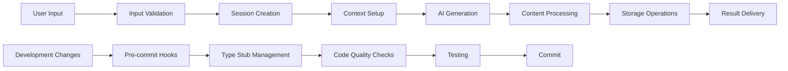
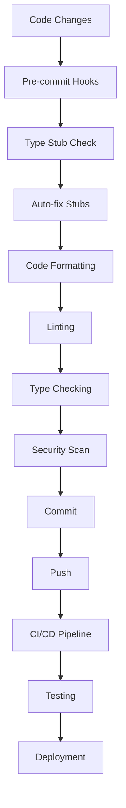

# Project Architecture for SVG Image Generation System

## System Architecture Overview

### 1. High-Level Architecture

```mermaid
graph TB
    subgraph "Frontend Layer"
        A[Streamlit UI]
        B[Session State Management]
        C[User Input Validation]
    end

    subgraph "Backend Layer"
        D[Session Management Service]
        E[AI Generation Service]
        F[Storage Service]
        G[Error Handling Service]
    end

    subgraph "External Services"
        H[Snowflake Data Platform]
        I[Cortex AI Service]
        J[File Storage (Stages)]
    end

    subgraph "Development Infrastructure"
        K[Type Stub Management]
        L[Pre-commit Hooks]
        M[Code Quality Tools]
        N[Testing Framework]
    end

    A --> D
    B --> D
    C --> D
    D --> H
    E --> I
    F --> J
    G --> D
    G --> E
    G --> F

    K --> M
    L --> M
    M --> N
```

### 2. Component Architecture

#### A. Frontend Components
```yaml
Streamlit Application:
  - Page Configuration:
      - Title and icon setup
      - Layout configuration
      - Session state initialization

  - User Interface:
      - Sidebar configuration
      - Main content area
      - Form components
      - Status indicators

  - State Management:
      - Session state persistence
      - Form validation
      - Error state handling
      - Success state display

  - Caching Layer:
      - Session caching
      - Data caching
      - Configuration caching
      - Type stub caching
```

#### B. Backend Services
```yaml
Session Management Service:
  - Connection Management:
      - SiS environment detection
      - Local development support
      - Environment variable handling
      - Connection pooling

  - Authentication:
      - Credential validation
      - Session token management
      - Permission checking
      - Error recovery

AI Generation Service:
  - Prompt Engineering:
      - Input sanitization
      - Context construction
      - Model selection
      - Response parsing

  - Cortex Integration:
      - Query construction
      - Response validation
      - Error handling
      - Performance optimization

Storage Service:
  - Stage Management:
      - Stage creation
      - File operations
      - Metadata tracking
      - Access control

  - Temporary Storage:
      - Table management
      - Data insertion
      - Content validation
      - Resource cleanup
```

#### C. Development Infrastructure
```yaml
Type Stub Management System:
  - Detection Engine:
      - Mypy integration
      - Output parsing
      - Package identification
      - Error classification

  - Resolution Engine:
      - Package mapping
      - Requirements management
      - Installation automation
      - Validation checking

  - Integration Layer:
      - Pre-commit hooks
      - CI/CD integration
      - IDE support
      - Documentation generation

Code Quality Pipeline:
  - Formatting Tools:
      - Black code formatter
      - isort import sorter
      - ruff fast linter
      - flake8 style checker

  - Security Tools:
      - bandit security linter
      - safety vulnerability scanner
      - Pre-commit integration
      - Automated scanning

  - Testing Framework:
      - pytest test runner
      - Mock utilities
      - Coverage reporting
      - Integration testing
```

### 3. Data Architecture

#### A. Data Flow Architecture


#### B. Storage Architecture
```yaml
Temporary Storage:
  - Transient Tables:
      - Purpose: Temporary SVG content storage
      - Lifecycle: Session-based
      - Cleanup: Automatic
      - Performance: Optimized for quick access

  - File System:
      - Purpose: Local development files
      - Lifecycle: Development session
      - Cleanup: Manual or automated
      - Security: Local access only

Persistent Storage:
  - Snowflake Stages:
      - Purpose: Generated SVG files
      - Lifecycle: Long-term storage
      - Access: Role-based permissions
      - Performance: Optimized for retrieval

  - Configuration Storage:
      - Purpose: Application settings
      - Lifecycle: Application lifetime
      - Access: Environment-based
      - Security: Encrypted credentials
```

### 4. Security Architecture

#### A. Authentication Architecture
```yaml
SiS Environment:
  - Authentication: Automatic via Snowflake
  - Session Management: Streamlit-in-Snowflake
  - Permissions: Role-based access control
  - Security: Snowflake-managed

Local Development:
  - Authentication: Environment variables
  - Session Management: Manual configuration
  - Permissions: Local user permissions
  - Security: Local credential management
```

#### B. Authorization Architecture
```yaml
Resource Access Control:
  - Database Access:
      - Read permissions
      - Write permissions
      - Schema access
      - Table operations

  - Stage Access:
      - File upload permissions
      - File download permissions
      - Stage management
      - Metadata access

  - AI Service Access:
      - Model access permissions
      - Query execution limits
      - Rate limiting
      - Cost controls
```

### 5. Development Architecture

#### A. Development Workflow Architecture


#### B. Type Safety Architecture
```yaml
Type Checking System:
  - Mypy Integration:
      - Static type checking
      - Type annotation validation
      - Import checking
      - Configuration management

  - Stub Management:
      - Automatic detection
      - Package mapping
      - Installation automation
      - Validation checking

  - IDE Integration:
      - Type hints
      - Autocomplete
      - Error detection
      - Refactoring support
```

### 6. Deployment Architecture

#### A. Environment Architecture
```yaml
Development Environment:
  - Local Setup:
      - Python virtual environment
      - Development dependencies
      - Type stubs
      - Local configuration

  - Development Tools:
      - Pre-commit hooks
      - Code quality tools
      - Testing framework
      - Documentation tools

Production Environment:
  - SiS Deployment:
      - Snowflake-managed
      - Automatic scaling
      - Built-in security
      - Performance optimization

  - Local Deployment:
      - Container-based
      - Environment variables
      - Health monitoring
      - Logging infrastructure
```

#### B. CI/CD Architecture
```yaml
Continuous Integration:
  - Code Quality:
      - Type checking
      - Linting
      - Security scanning
      - Format validation

  - Testing:
      - Unit tests
      - Integration tests
      - Type stub validation
      - Performance tests

  - Documentation:
      - README updates
      - API documentation
      - Ontology updates
      - Contributing guidelines

Continuous Deployment:
  - Automated Testing:
      - Pre-deployment validation
      - Smoke tests
      - Integration verification
      - Performance monitoring

  - Deployment Pipeline:
      - Environment preparation
      - Dependency installation
      - Configuration setup
      - Health checks
```

### 7. Performance Architecture

#### A. Caching Architecture
```yaml
Application Caching:
  - Session Caching:
      - Cache key: User session
      - TTL: 1 hour
      - Invalidation: Session timeout
      - Storage: Memory

  - Data Caching:
      - Cache key: Stage contents
      - TTL: 1 hour
      - Invalidation: Manual refresh
      - Storage: Memory

  - Configuration Caching:
      - Cache key: App configuration
      - TTL: 24 hours
      - Invalidation: Config changes
      - Storage: Memory

  - Type Stub Caching:
      - Cache key: Mypy results
      - TTL: 1 hour
      - Invalidation: Requirements changes
      - Storage: File system
```

#### B. Resource Management Architecture
```yaml
Memory Management:
  - Temporary Data:
      - Automatic cleanup
      - Size limits
      - Lifecycle management
      - Error recovery

  - Connection Pooling:
      - Pool size management
      - Connection reuse
      - Timeout handling
      - Health monitoring

CPU Management:
  - Async Operations:
      - Non-blocking I/O
      - Background processing
      - Task scheduling
      - Load balancing

  - Type Checking:
      - Incremental checking
      - Parallel processing
      - Cache utilization
      - Performance optimization
```

### 8. Monitoring Architecture

#### A. Logging Architecture
```yaml
Application Logging:
  - User Actions:
      - Input validation
      - Generation requests
      - Error conditions
      - Success events

  - System Events:
      - Session management
      - AI service calls
      - Storage operations
      - Performance metrics

  - Development Events:
      - Type checking results
      - Pre-commit execution
      - Dependency management
      - Build processes

Audit Logging:
  - Authentication Events:
      - Login attempts
      - Session creation
      - Permission checks
      - Access violations

  - Data Access:
      - File operations
      - Database queries
      - Stage access
      - Configuration changes
```

#### B. Metrics Architecture
```yaml
Performance Metrics:
  - Response Times:
      - UI rendering
      - AI generation
      - File operations
      - Database queries

  - Throughput:
      - Requests per second
      - Concurrent users
      - Resource utilization
      - Error rates

  - Quality Metrics:
      - Type coverage
      - Test coverage
      - Code quality scores
      - Security scan results

Business Metrics:
  - User Engagement:
      - Active users
      - Generation success rate
      - Feature usage
      - User satisfaction

  - System Health:
      - Uptime
      - Error rates
      - Performance trends
      - Resource usage
```

### 9. Error Handling Architecture

#### A. Error Classification Architecture
```yaml
Error Categories:
  - Input Errors:
      - Validation failures
      - Format errors
      - Missing required fields
      - Invalid selections

  - Session Errors:
      - Connection failures
      - Authentication errors
      - Permission denied
      - Session timeout

  - AI Service Errors:
      - Service unavailable
      - Model errors
      - Generation failures
      - Timeout errors

  - Storage Errors:
      - Stage creation failures
      - File upload errors
      - Permission issues
      - Cleanup failures

  - Development Errors:
      - Type stub issues
      - Pre-commit failures
      - Build errors
      - Test failures
```

#### B. Error Recovery Architecture
```yaml
Recovery Strategies:
  - Retry Logic:
      - Exponential backoff
      - Maximum retry attempts
      - Error classification
      - Success criteria

  - Fallback Options:
      - Alternative services
      - Cached responses
      - Default values
      - Graceful degradation

  - State Recovery:
      - UI state restoration
      - Session recovery
      - Data consistency
      - User notification
```

### 10. Integration Architecture

#### A. External Service Integration
```yaml
Snowflake Integration:
  - Connection Management:
      - Connection pooling
      - Authentication handling
      - Session lifecycle
      - Error recovery

  - Data Operations:
      - SQL execution
      - Result processing
      - Transaction management
      - Performance optimization

Cortex AI Integration:
  - Service Communication:
      - Query construction
      - Response parsing
      - Error handling
      - Performance monitoring

  - Model Management:
      - Model selection
      - Parameter configuration
      - Response validation
      - Cost optimization
```

#### B. Development Tool Integration
```yaml
Pre-commit Integration:
  - Hook Management:
      - Automatic execution
      - Error handling
      - Success criteria
      - Rollback procedures

  - Tool Coordination:
      - Execution order
      - Dependency management
      - Result aggregation
      - Status reporting

CI/CD Integration:
  - Pipeline Management:
      - Stage coordination
      - Dependency resolution
      - Error handling
      - Success criteria

  - Tool Integration:
      - Testing framework
      - Quality tools
      - Security scanners
      - Deployment automation
```

This comprehensive architecture ensures a robust, scalable, and maintainable system with excellent developer experience and automated quality assurance.
