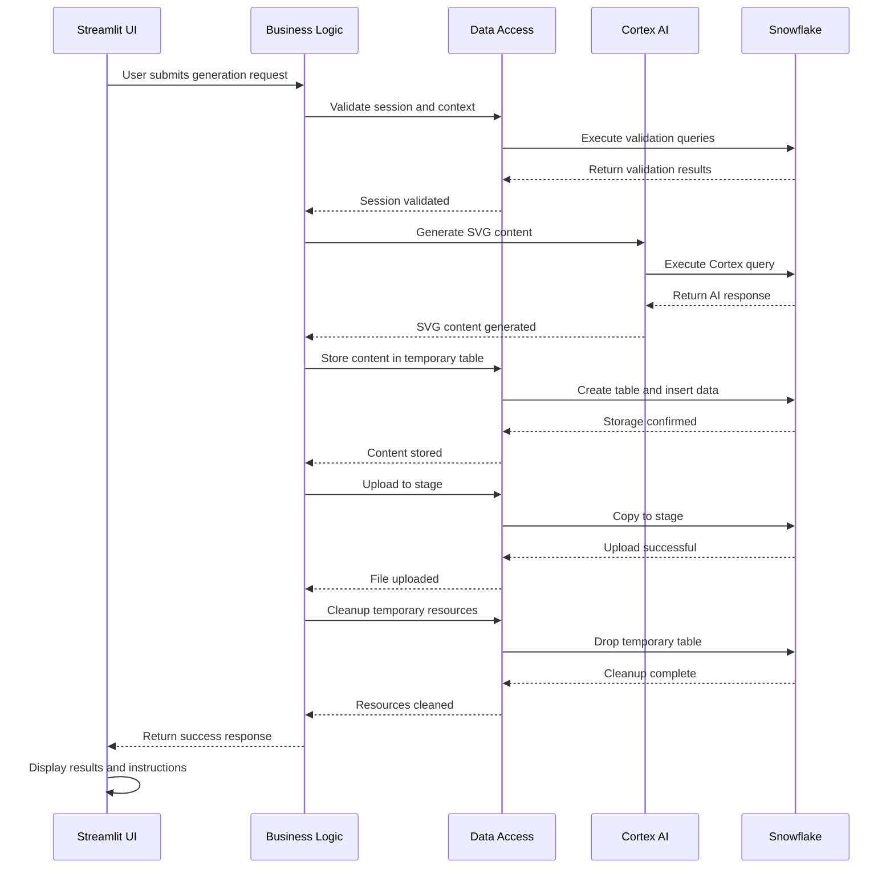
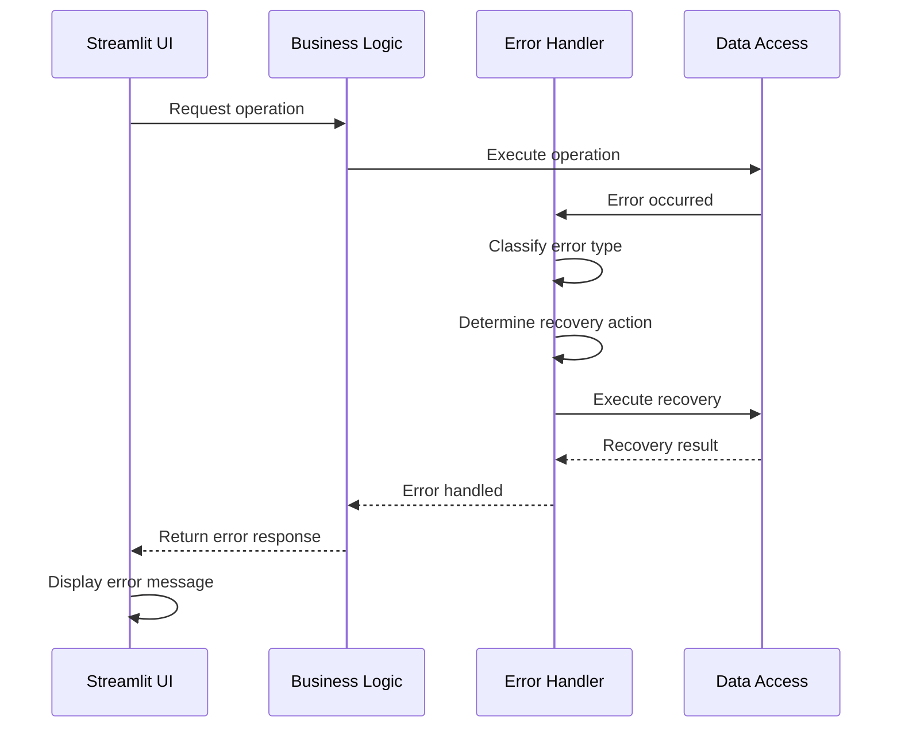

# System Components for SVG Image Generation System

## Component Architecture Overview

The SVG Image Generation system is built using a layered architecture with clear separation of concerns. Each component has specific responsibilities and well-defined interfaces.

## Core System Components

### 1. Presentation Layer (Streamlit UI)

#### A. Main Application Component
```yaml
Component: MainApp
Responsibilities:
  - Application initialization
  - Page configuration
  - Layout management
  - Navigation handling
  - Global state management

Dependencies:
  - Streamlit framework
  - Session management service
  - Configuration service

Interfaces:
  - initialize_app()
  - configure_page()
  - setup_layout()
  - handle_navigation()
```

#### B. User Interface Components
```yaml
Component: SidebarPanel
Responsibilities:
  - Stage configuration input
  - Database/schema selection
  - Configuration validation
  - User feedback display

Component: MainPanel
Responsibilities:
  - SVG prompt input
  - Model selection
  - File naming interface
  - Generation controls
  - Result display

Component: StatusPanel
Responsibilities:
  - Session information display
  - Progress indicators
  - Error message display
  - Success notifications
```

### 2. Business Logic Layer

#### A. Session Management Service
```yaml
Component: SessionService
Responsibilities:
  - Snowflake session creation
  - Session validation
  - Connection management
  - Session lifecycle handling
  - Error recovery

Methods:
  - get_active_session()
  - validate_session()
  - switch_context()
  - cleanup_session()

Dependencies:
  - Snowflake Snowpark
  - Configuration service
  - Error handling service
```

#### B. AI Generation Service
```yaml
Component: AIGenerationService
Responsibilities:
  - Prompt construction
  - Cortex AI integration
  - Response processing
  - Content validation
  - Error handling

Methods:
  - generate_svg_content(prompt, model)
  - construct_prompt(description)
  - validate_svg_content(content)
  - extract_svg_from_response(response)

Dependencies:
  - Snowflake session
  - Cortex AI service
  - Validation service
```

#### C. Storage Service
```yaml
Component: StorageService
Responsibilities:
  - Stage management
  - File operations
  - Temporary table management
  - Resource cleanup
  - Metadata tracking

Methods:
  - create_stage(stage_name)
  - upload_file(content, filename, stage)
  - create_temp_table(table_name)
  - cleanup_resources()
  - list_stage_contents(stage_name)

Dependencies:
  - Snowflake session
  - File handling service
  - Cleanup service
```

### 3. Data Access Layer

#### A. Snowflake Data Access
```yaml
Component: SnowflakeDAO
Responsibilities:
  - SQL query execution
  - Result set processing
  - Transaction management
  - Connection pooling
  - Query optimization

Methods:
  - execute_query(query)
  - execute_transaction(queries)
  - process_results(result_set)
  - handle_errors(error)

Dependencies:
  - Snowflake connector
  - Connection pool
  - Error handling service
```

#### B. File System Access
```yaml
Component: FileSystemDAO
Responsibilities:
  - Temporary file operations
  - File validation
  - Path management
  - Security checks
  - Cleanup operations

Methods:
  - create_temp_file(content)
  - validate_file_path(path)
  - cleanup_temp_files()
  - secure_file_operations()

Dependencies:
  - OS file system
  - Security service
  - Validation service
```

### 4. Integration Layer

#### A. Cortex AI Integration
```yaml
Component: CortexAIIntegration
Responsibilities:
  - AI service communication
  - Model management
  - Request/response handling
  - Error handling
  - Performance monitoring

Methods:
  - call_cortex_model(prompt, model)
  - validate_model_availability(model)
  - handle_ai_errors(error)
  - monitor_performance(metrics)

Dependencies:
  - Snowflake Cortex service
  - Model registry
  - Monitoring service
```

#### B. Streamlit Integration
```yaml
Component: StreamlitIntegration
Responsibilities:
  - UI component rendering
  - State management
  - Event handling
  - Caching management
  - Component lifecycle

Methods:
  - render_components()
  - manage_state()
  - handle_events()
  - manage_cache()

Dependencies:
  - Streamlit framework
  - State management service
  - Event handling service
```

## Component Interactions

### 1. Primary Workflow Interactions


### 2. Error Handling Interactions


## Component Configuration

### 1. Service Configuration
```yaml
SessionService:
  config:
    connection_timeout: 30
    retry_attempts: 3
    cache_ttl: 3600
    max_connections: 10

AIGenerationService:
  config:
    model_timeout: 60
    max_prompt_length: 1000
    retry_attempts: 2
    fallback_model: "claude-3-5-sonnet"

StorageService:
  config:
    max_file_size: 1048576
    temp_table_ttl: 3600
    stage_cleanup_interval: 86400
    max_stage_files: 1000
```

### 2. Component Dependencies Configuration
```yaml
Dependency Injection:
  services:
    session_service: SessionService
    ai_service: AIGenerationService
    storage_service: StorageService
    error_handler: ErrorHandlingService
  
  configurations:
    snowflake_config: SnowflakeConfig
    ai_config: AIConfig
    storage_config: StorageConfig
    ui_config: UIConfig
```

## Component Lifecycle Management

### 1. Initialization Phase
```yaml
Initialization Order:
  1. Configuration loading
  2. Service container setup
  3. Dependency injection
  4. Connection pool initialization
  5. Cache initialization
  6. UI component setup
  7. Event handler registration
  8. Health check execution
```

### 2. Runtime Phase
```yaml
Runtime Operations:
  - Request processing
  - State management
  - Resource allocation
  - Performance monitoring
  - Error handling
  - Cache management
  - Connection pooling
```

### 3. Shutdown Phase
```yaml
Shutdown Order:
  1. Stop accepting new requests
  2. Complete pending operations
  3. Release resources
  4. Close connections
  5. Clear caches
  6. Save state
  7. Log shutdown
  8. Terminate processes
```

## Component Testing

### 1. Unit Testing
```yaml
Test Components:
  - SessionService:
      - Session creation
      - Session validation
      - Context switching
      - Error handling
  
  - AIGenerationService:
      - Prompt construction
      - Response processing
      - Content validation
      - Error handling
  
  - StorageService:
      - Stage operations
      - File operations
      - Cleanup operations
      - Error handling
```

### 2. Integration Testing
```yaml
Integration Tests:
  - End-to-end workflows
  - Component interactions
  - Error scenarios
  - Performance tests
  - Security tests
  - Load tests
```

## Component Monitoring

### 1. Health Checks
```yaml
Health Check Components:
  - SessionService:
      - Connection status
      - Authentication status
      - Response time
  
  - AIGenerationService:
      - Model availability
      - Response time
      - Success rate
  
  - StorageService:
      - Stage accessibility
      - File operations
      - Cleanup status
```

### 2. Performance Metrics
```yaml
Performance Metrics:
  - Response times
  - Throughput
  - Error rates
  - Resource usage
  - Cache hit rates
  - Connection pool usage
```

## Component Security

### 1. Input Validation
```yaml
Validation Components:
  - Prompt validation
  - File name validation
  - Stage name validation
  - Model selection validation
  - SQL injection prevention
  - XSS prevention
```

### 2. Access Control
```yaml
Access Control:
  - Authentication
  - Authorization
  - Role-based access
  - Resource permissions
  - Audit logging
```

## Component Scalability

### 1. Horizontal Scaling
```yaml
Scaling Components:
  - Load balancing
  - Session distribution
  - Cache sharing
  - Database connection pooling
  - Resource management
```

### 2. Vertical Scaling
```yaml
Resource Scaling:
  - Memory allocation
  - CPU utilization
  - Connection limits
  - Cache sizes
  - Queue depths
```

## Component Maintenance

### 1. Update Procedures
```yaml
Update Process:
  - Version management
  - Dependency updates
  - Configuration changes
  - Database migrations
  - Cache invalidation
```

### 2. Backup and Recovery
```yaml
Backup Components:
  - Configuration backup
  - State backup
  - Data backup
  - Recovery procedures
  - Disaster recovery
``` 