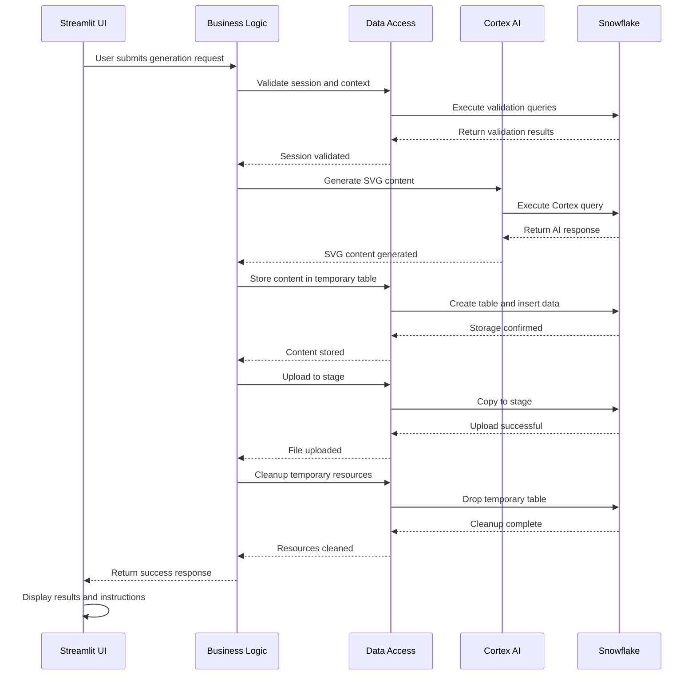
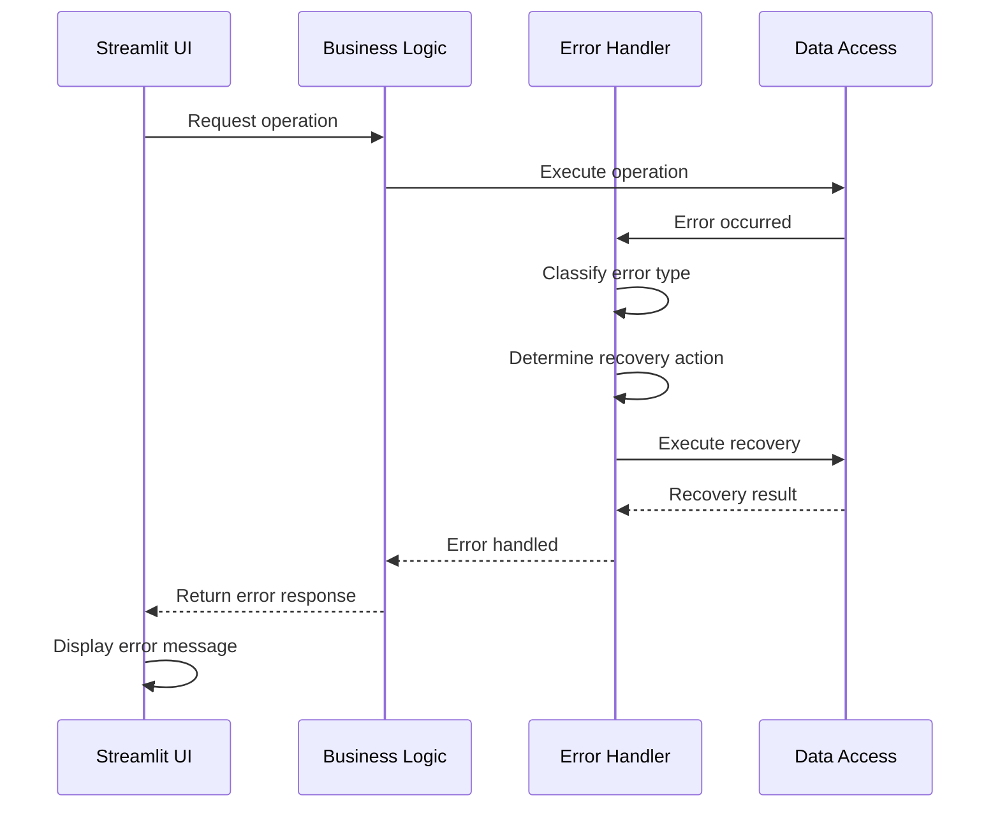

# System Components for SVG Image Generation System

## Component Architecture Overview

The SVG Image Generation system is built using a layered architecture with clear separation of concerns. Each component has specific responsibilities and well-defined interfaces.

## Core System Components

### 1. Frontend Components

#### A. Streamlit Application Core
```yaml
Component: StreamlitApp
Purpose: Main web application interface
Responsibilities:
  - User interface rendering
  - Session state management
  - Form validation and processing
  - Error display and user feedback
  - File upload/download handling
  - Real-time updates and progress indicators

Dependencies:
  - streamlit package
  - Session management service
  - AI generation service
  - Storage service
  - Error handling service

Configuration:
  - Page title and icon
  - Layout settings
  - Theme configuration
  - Session state initialization
  - Caching policies
```

#### B. User Interface Components
```yaml
Component: SidebarConfig
Purpose: Configuration sidebar interface
Responsibilities:
  - Stage name input and validation
  - Database and schema selection
  - Context switching controls
  - Configuration persistence
  - User preference management

Component: MainInterface
Purpose: Primary user interaction area
Responsibilities:
  - Text input for SVG descriptions
  - Model selection dropdown
  - File naming interface
  - Generation button and controls
  - Result display and preview
  - Download instructions

Component: StatusIndicators
Purpose: System status and feedback display
Responsibilities:
  - Connection status display
  - Generation progress indicators
  - Error message display
  - Success notifications
  - Loading states
```

### 2. Backend Service Components

#### A. Session Management Service
```yaml
Component: SessionManager
Purpose: Snowflake session lifecycle management
Responsibilities:
  - Session creation and validation
  - Connection pooling and management
  - Authentication handling
  - Context switching
  - Session cleanup and error recovery

Dependencies:
  - snowflake-snowpark-python
  - Environment configuration
  - Error handling service

Configuration:
  - Connection parameters
  - Pool size settings
  - Timeout configurations
  - Retry policies
  - Error thresholds
```

#### B. AI Generation Service
```yaml
Component: AIGenerator
Purpose: Cortex AI integration and SVG generation
Responsibilities:
  - Prompt engineering and construction
  - AI model selection and configuration
  - Query execution and response parsing
  - Content validation and processing
  - Error handling and retry logic

Dependencies:
  - Snowflake session
  - Cortex AI service
  - Error handling service
  - Content validation service

Configuration:
  - Model parameters
  - Prompt templates
  - Response validation rules
  - Timeout settings
  - Retry policies
```

#### C. Storage Service
```yaml
Component: StorageManager
Purpose: File storage and stage management
Responsibilities:
  - Stage creation and management
  - File upload and download operations
  - Temporary table management
  - Metadata tracking
  - Resource cleanup

Dependencies:
  - Snowflake session
  - Error handling service
  - File processing service

Configuration:
  - Stage naming conventions
  - File size limits
  - Cleanup policies
  - Access control settings
  - Performance optimizations
```

#### D. Error Handling Service
```yaml
Component: ErrorHandler
Purpose: Centralized error management and recovery
Responsibilities:
  - Error classification and categorization
  - User-friendly error messages
  - Error logging and monitoring
  - Recovery strategy execution
  - State restoration

Dependencies:
  - Logging service
  - Monitoring service
  - Recovery strategies

Configuration:
  - Error thresholds
  - Retry policies
  - Logging levels
  - Recovery strategies
  - User notification settings
```

### 3. Development Infrastructure Components

#### A. Type Stub Management System
```yaml
Component: StubManager
Purpose: Automated type stub detection and management
Responsibilities:
  - Mypy output parsing
  - Package name mapping
  - Requirements file management
  - Stub installation automation
  - Validation and testing

Dependencies:
  - mypy package
  - subprocess module
  - requirements-dev.txt file
  - Package mapping system

Configuration:
  - Package mapping rules
  - Installation policies
  - Validation criteria
  - Error handling strategies
  - Performance optimizations

Features:
  - Automatic stub detection
  - Comprehensive package mapping (80+ packages)
  - Built-in module handling
  - Special case management
  - Pre-commit integration
```

#### B. Pre-commit Hook System
```yaml
Component: PreCommitManager
Purpose: Automated code quality and type safety checks
Responsibilities:
  - Hook execution coordination
  - Type stub management integration
  - Code formatting and linting
  - Security scanning
  - Quality assurance automation

Dependencies:
  - pre-commit package
  - All development tools
  - Type stub management system
  - Git repository

Configuration:
  - Hook execution order
  - Tool configurations
  - Success criteria
  - Error handling policies
  - Performance settings

Hooks:
  - fix-missing-type-stubs (local)
  - black (code formatting)
  - ruff (fast linting)
  - mypy (type checking)
  - bandit (security scanning)
  - safety (vulnerability scanning)
```

#### C. Code Quality Pipeline
```yaml
Component: QualityManager
Purpose: Comprehensive code quality assurance
Responsibilities:
  - Code formatting enforcement
  - Style guide compliance
  - Import organization
  - Security vulnerability detection
  - Performance optimization

Dependencies:
  - black (formatter)
  - ruff (linter)
  - isort (import sorter)
  - flake8 (style checker)
  - bandit (security linter)
  - safety (vulnerability scanner)

Configuration:
  - Formatting rules
  - Linting policies
  - Security thresholds
  - Performance criteria
  - Integration settings
```

#### D. Testing Framework
```yaml
Component: TestManager
Purpose: Automated testing and validation
Responsibilities:
  - Unit test execution
  - Integration test coordination
  - Coverage reporting
  - Performance testing
  - Type stub validation

Dependencies:
  - pytest framework
  - pytest-mock
  - pytest-cov
  - Test data and fixtures
  - Mock services

Configuration:
  - Test discovery patterns
  - Coverage thresholds
  - Performance benchmarks
  - Mock configurations
  - Reporting settings
```

### 4. Data Management Components

#### A. Configuration Management
```yaml
Component: ConfigManager
Purpose: Application configuration and environment management
Responsibilities:
  - Environment variable loading
  - Configuration validation
  - Default value management
  - Configuration caching
  - Environment-specific settings

Dependencies:
  - python-dotenv package
  - Environment variables
  - Configuration files
  - Validation service

Configuration:
  - Environment detection
  - Variable mapping
  - Validation rules
  - Caching policies
  - Error handling
```

#### B. Caching System
```yaml
Component: CacheManager
Purpose: Performance optimization through caching
Responsibilities:
  - Session caching
  - Data caching
  - Configuration caching
  - Type stub caching
  - Cache invalidation

Dependencies:
  - Streamlit cache decorators
  - Memory management
  - Cache policies
  - Invalidation strategies

Configuration:
  - Cache TTL settings
  - Memory limits
  - Invalidation policies
  - Performance thresholds
  - Monitoring settings
```

### 5. Integration Components

#### A. Snowflake Integration Layer
```yaml
Component: SnowflakeConnector
Purpose: Snowflake platform integration
Responsibilities:
  - Connection management
  - SQL execution
  - Result processing
  - Transaction management
  - Performance optimization

Dependencies:
  - snowflake-snowpark-python
  - snowflake-connector-python
  - Connection pooling
  - Error handling

Configuration:
  - Connection parameters
  - Pool settings
  - Timeout configurations
  - Retry policies
  - Performance settings
```

#### B. Cortex AI Integration
```yaml
Component: CortexConnector
Purpose: Snowflake Cortex AI service integration
Responsibilities:
  - AI model access
  - Query construction
  - Response processing
  - Error handling
  - Performance monitoring

Dependencies:
  - Snowflake session
  - AI service access
  - Query templates
  - Response parsers

Configuration:
  - Model parameters
  - Query templates
  - Response validation
  - Error handling
  - Performance settings
```

### 6. Monitoring and Observability Components

#### A. Logging System
```yaml
Component: LogManager
Purpose: Comprehensive application logging
Responsibilities:
  - User action logging
  - System event logging
  - Error logging
  - Performance logging
  - Audit trail maintenance

Dependencies:
  - Python logging module
  - Log configuration
  - Log storage
  - Log analysis tools

Configuration:
  - Log levels
  - Log formats
  - Storage policies
  - Retention settings
  - Analysis tools
```

#### B. Metrics Collection
```yaml
Component: MetricsCollector
Purpose: System performance and business metrics
Responsibilities:
  - Performance metric collection
  - Business metric tracking
  - Quality metric monitoring
  - Development metric tracking
  - Metric aggregation and reporting

Dependencies:
  - Metrics storage
  - Collection agents
  - Analysis tools
  - Reporting systems

Configuration:
  - Collection intervals
  - Metric definitions
  - Storage policies
  - Analysis rules
  - Reporting schedules
```

### 7. Security Components

#### A. Authentication Service
```yaml
Component: AuthManager
Purpose: User authentication and session security
Responsibilities:
  - Credential validation
  - Session token management
  - Permission checking
  - Security policy enforcement
  - Audit logging

Dependencies:
  - Snowflake authentication
  - Session management
  - Security policies
  - Audit logging

Configuration:
  - Authentication methods
  - Token policies
  - Permission rules
  - Security thresholds
  - Audit settings
```

#### B. Security Scanner
```yaml
Component: SecurityScanner
Purpose: Code and dependency security analysis
Responsibilities:
  - Code security analysis
  - Dependency vulnerability scanning
  - Security policy enforcement
  - Security reporting
  - Remediation guidance

Dependencies:
  - bandit (code security)
  - safety (dependency security)
  - Security policies
  - Reporting tools

Configuration:
  - Security rules
  - Vulnerability thresholds
  - Scanning policies
  - Reporting formats
  - Remediation workflows
```

### 8. Deployment Components

#### A. Environment Manager
```yaml
Component: EnvironmentManager
Purpose: Environment-specific configuration and deployment
Responsibilities:
  - Environment detection
  - Configuration loading
  - Dependency management
  - Environment validation
  - Deployment coordination

Dependencies:
  - Environment variables
  - Configuration files
  - Dependency managers
  - Validation services

Configuration:
  - Environment types
  - Configuration mapping
  - Validation rules
  - Deployment policies
  - Error handling
```

#### B. CI/CD Pipeline
```yaml
Component: PipelineManager
Purpose: Continuous integration and deployment automation
Responsibilities:
  - Build automation
  - Test execution
  - Quality checks
  - Deployment coordination
  - Pipeline monitoring

Dependencies:
  - CI/CD platform
  - Build tools
  - Test frameworks
  - Deployment tools
  - Monitoring systems

Configuration:
  - Build steps
  - Test policies
  - Quality gates
  - Deployment rules
  - Monitoring settings
```

### 9. Utility Components

#### A. File Processing Service
```yaml
Component: FileProcessor
Purpose: File handling and processing utilities
Responsibilities:
  - File validation
  - Format conversion
  - Content processing
  - Temporary file management
  - Cleanup operations

Dependencies:
  - File system access
  - Format libraries
  - Validation rules
  - Processing pipelines

Configuration:
  - File size limits
  - Format support
  - Processing rules
  - Cleanup policies
  - Error handling
```

#### B. Validation Service
```yaml
Component: ValidationManager
Purpose: Input and data validation
Responsibilities:
  - Input validation
  - Data format validation
  - Business rule validation
  - Error reporting
  - Validation caching

Dependencies:
  - Validation rules
  - Error handling
  - Caching system
  - Reporting tools

Configuration:
  - Validation rules
  - Error messages
  - Caching policies
  - Reporting formats
  - Performance settings
```

### 10. Helper Components

#### A. Package Mapping System
```yaml
Component: PackageMapper
Purpose: Comprehensive package name to type stub mapping
Responsibilities:
  - Package name mapping
  - Special case handling
  - Built-in module detection
  - Mapping validation
  - Mapping updates

Dependencies:
  - Package mapping data
  - Validation rules
  - Update mechanisms
  - Error handling

Configuration:
  - Mapping rules
  - Special cases
  - Validation criteria
  - Update policies
  - Error handling
```

#### B. Development Workflow Coordinator
```yaml
Component: WorkflowCoordinator
Purpose: Development process automation and coordination
Responsibilities:
  - Workflow orchestration
  - Tool coordination
  - Process automation
  - Quality assurance
  - Developer experience optimization

Dependencies:
  - All development tools
  - Workflow definitions
  - Automation scripts
  - Quality metrics

Configuration:
  - Workflow steps
  - Tool configurations
  - Quality gates
  - Automation rules
  - Performance settings
```

This comprehensive component architecture ensures modular, maintainable, and scalable development with excellent developer experience and automated quality assurance.

## Component Interactions

### 1. Primary Workflow Interactions


### 2. Error Handling Interactions


## Component Configuration

### 1. Service Configuration
```yaml
SessionService:
  config:
    connection_timeout: 30
    retry_attempts: 3
    cache_ttl: 3600
    max_connections: 10

AIGenerationService:
  config:
    model_timeout: 60
    max_prompt_length: 1000
    retry_attempts: 2
    fallback_model: "claude-3-5-sonnet"

StorageService:
  config:
    max_file_size: 1048576
    temp_table_ttl: 3600
    stage_cleanup_interval: 86400
    max_stage_files: 1000
```

### 2. Component Dependencies Configuration
```yaml
Dependency Injection:
  services:
    session_service: SessionService
    ai_service: AIGenerationService
    storage_service: StorageService
    error_handler: ErrorHandlingService

  configurations:
    snowflake_config: SnowflakeConfig
    ai_config: AIConfig
    storage_config: StorageConfig
    ui_config: UIConfig
```

## Component Lifecycle Management

### 1. Initialization Phase
```yaml
Initialization Order:
  1. Configuration loading
  2. Service container setup
  3. Dependency injection
  4. Connection pool initialization
  5. Cache initialization
  6. UI component setup
  7. Event handler registration
  8. Health check execution
```

### 2. Runtime Phase
```yaml
Runtime Operations:
  - Request processing
  - State management
  - Resource allocation
  - Performance monitoring
  - Error handling
  - Cache management
  - Connection pooling
```

### 3. Shutdown Phase
```yaml
Shutdown Order:
  1. Stop accepting new requests
  2. Complete pending operations
  3. Release resources
  4. Close connections
  5. Clear caches
  6. Save state
  7. Log shutdown
  8. Terminate processes
```

## Component Testing

### 1. Unit Testing
```yaml
Test Components:
  - SessionService:
      - Session creation
      - Session validation
      - Context switching
      - Error handling

  - AIGenerationService:
      - Prompt construction
      - Response processing
      - Content validation
      - Error handling

  - StorageService:
      - Stage operations
      - File operations
      - Cleanup operations
      - Error handling
```

### 2. Integration Testing
```yaml
Integration Tests:
  - End-to-end workflows
  - Component interactions
  - Error scenarios
  - Performance tests
  - Security tests
  - Load tests
```

## Component Monitoring

### 1. Health Checks
```yaml
Health Check Components:
  - SessionService:
      - Connection status
      - Authentication status
      - Response time

  - AIGenerationService:
      - Model availability
      - Response time
      - Success rate

  - StorageService:
      - Stage accessibility
      - File operations
      - Cleanup status
```

### 2. Performance Metrics
```yaml
Performance Metrics:
  - Response times
  - Throughput
  - Error rates
  - Resource usage
  - Cache hit rates
  - Connection pool usage
```

## Component Security

### 1. Input Validation
```yaml
Validation Components:
  - Prompt validation
  - File name validation
  - Stage name validation
  - Model selection validation
  - SQL injection prevention
  - XSS prevention
```

### 2. Access Control
```yaml
Access Control:
  - Authentication
  - Authorization
  - Role-based access
  - Resource permissions
  - Audit logging
```

## Component Scalability

### 1. Horizontal Scaling
```yaml
Scaling Components:
  - Load balancing
  - Session distribution
  - Cache sharing
  - Database connection pooling
  - Resource management
```

### 2. Vertical Scaling
```yaml
Resource Scaling:
  - Memory allocation
  - CPU utilization
  - Connection limits
  - Cache sizes
  - Queue depths
```

## Component Maintenance

### 1. Update Procedures
```yaml
Update Process:
  - Version management
  - Dependency updates
  - Configuration changes
  - Database migrations
  - Cache invalidation
```

### 2. Backup and Recovery
```yaml
Backup Components:
  - Configuration backup
  - State backup
  - Data backup
  - Recovery procedures
  - Disaster recovery
```
