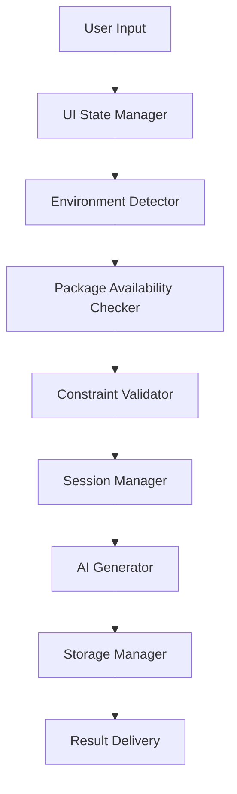
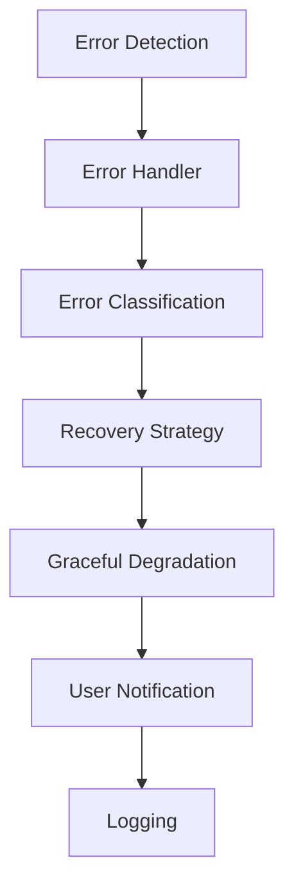
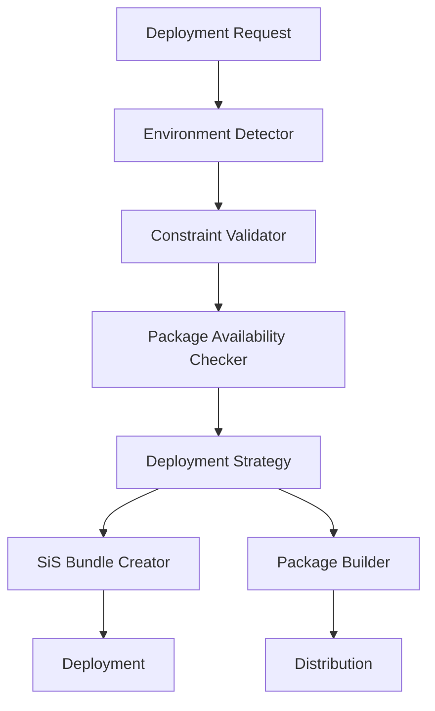

# System Components for SVG Image Generation System

## 🏗️ Component Architecture Overview

The SVG Image Generation system is built using a modular, layered architecture with clear separation of concerns. Each component has well-defined responsibilities, dependencies, and interfaces.

## 📦 Core Components

### 1. Presentation Layer Components

#### A. Streamlit UI Component
```yaml
Component: StreamlitUI
Purpose: User interface and interaction management
Responsibilities:
  - User input handling and validation
  - UI state management and persistence
  - Real-time updates and feedback
  - Error display and user notification
  - File preview and download interface
  - Responsive layout management

Dependencies:
  - Streamlit framework
  - Business logic services
  - Error handling service
  - Configuration service
  - Session management service

Configuration:
  - UI layout settings
  - Component styling
  - Error message templates
  - Performance thresholds
  - User experience preferences

Interfaces:
  - Input validation interface
  - State management interface
  - Error reporting interface
  - File handling interface
```

#### B. UI State Manager
```yaml
Component: UIStateManager
Purpose: User interface state management
Responsibilities:
  - Session state persistence
  - Form validation state
  - Loading state management
  - Error state handling
  - Success state display
  - Cache invalidation

Dependencies:
  - Streamlit session state
  - Validation service
  - Error handling service
  - Configuration service

Configuration:
  - State persistence settings
  - Validation rules
  - Cache policies
  - Error handling policies
```

### 2. Business Logic Layer Components

#### A. Session Management Service
```yaml
Component: SessionManager
Purpose: Multi-tier authentication and session management
Responsibilities:
  - Three-tier authentication system:
    1. Active session management (SiS environment)
    2. Connection parameter detection (various Snowflake environments)
    3. Environment variable configuration (local development)
  - Session creation and validation
  - Connection pooling and management
  - Authentication handling with graceful fallback
  - Context switching
  - Session cleanup and error recovery

Dependencies:
  - snowflake-snowpark-python
  - Environment configuration
  - Error handling service
  - Connection parameter detection
  - Deployment environment detection

Configuration:
  - Connection parameters
  - Pool size settings
  - Timeout configurations
  - Retry policies
  - Error thresholds
  - Authentication method priority

Interfaces:
  - Session creation interface
  - Authentication interface
  - Context management interface
  - Error handling interface
```

#### B. AI Generation Service
```yaml
Component: AIGenerator
Purpose: Cortex AI integration and SVG generation
Responsibilities:
  - Prompt engineering and construction
  - AI model selection and configuration
  - Query execution and response parsing
  - Content validation and processing
  - Error handling and retry logic
  - Performance optimization

Dependencies:
  - Snowflake session
  - Cortex AI service
  - Error handling service
  - Content validation service
  - Model management service

Configuration:
  - Model parameters
  - Prompt templates
  - Response validation rules
  - Timeout settings
  - Retry policies
  - Performance thresholds

Interfaces:
  - Model selection interface
  - Prompt generation interface
  - Query execution interface
  - Response processing interface
```

#### C. Storage Service
```yaml
Component: StorageManager
Purpose: File storage and stage management
Responsibilities:
  - Stage creation and management
  - File upload and download operations
  - Temporary table management
  - Metadata tracking
  - Resource cleanup
  - Access control enforcement

Dependencies:
  - Snowflake session
  - Error handling service
  - File processing service
  - Permission validation service

Configuration:
  - Stage naming conventions
  - File size limits
  - Cleanup policies
  - Access control settings
  - Performance optimizations

Interfaces:
  - Stage management interface
  - File operations interface
  - Metadata management interface
  - Cleanup interface
```

### 3. Data Access Layer Components

#### A. Snowflake DAO
```yaml
Component: SnowflakeDAO
Purpose: Data access operations for Snowflake
Responsibilities:
  - SQL query execution
  - Result set processing
  - Transaction management
  - Connection management
  - Performance optimization
  - Error handling

Dependencies:
  - Snowflake session
  - Query builder
  - Result processor
  - Error handling service

Configuration:
  - Query timeout settings
  - Result set limits
  - Transaction policies
  - Performance settings
```

#### B. File System Manager
```yaml
Component: FileSystemManager
Purpose: Local file system operations
Responsibilities:
  - Temporary file management
  - File validation
  - Format conversion
  - Cleanup operations
  - Security validation

Dependencies:
  - File system access
  - Validation service
  - Security service
  - Error handling service

Configuration:
  - File size limits
  - Allowed formats
  - Security policies
  - Cleanup policies
```

### 4. Integration Layer Components

#### A. Cortex AI Connector
```yaml
Component: CortexConnector
Purpose: Snowflake Cortex AI service integration
Responsibilities:
  - AI model access and management
  - Query construction and execution
  - Response processing and validation
  - Error handling and recovery
  - Performance monitoring
  - Cost optimization

Dependencies:
  - Snowflake session
  - AI service access
  - Query templates
  - Response parsers
  - Error handling service

Configuration:
  - Model parameters
  - Query templates
  - Response validation
  - Error handling
  - Performance settings
  - Cost limits

Interfaces:
  - Model access interface
  - Query execution interface
  - Response processing interface
  - Error handling interface
```

#### B. Streamlit Integration
```yaml
Component: StreamlitIntegration
Purpose: Streamlit platform integration
Responsibilities:
  - Component rendering
  - Event handling
  - State management
  - Performance optimization
  - API compliance
  - Error reporting

Dependencies:
  - Streamlit framework
  - UI components
  - State manager
  - Error handler

Configuration:
  - Component settings
  - Performance thresholds
  - API compliance rules
  - Error handling policies
```

## 🚀 Deployment Components

### 1. Deployment Environment Detection

#### A. Environment Detector
```yaml
Component: EnvironmentDetector
Purpose: Detect and classify deployment environment
Responsibilities:
  - Runtime environment detection
  - Package availability checking
  - Python version validation
  - Snowflake environment detection
  - Configuration file presence
  - Environment classification

Dependencies:
  - Runtime environment
  - Package availability checker
  - Version validator
  - Configuration manager

Configuration:
  - Environment indicators
  - Detection rules
  - Fallback mechanisms
  - Classification criteria

Interfaces:
  - Environment detection interface
  - Classification interface
  - Validation interface
  - Fallback interface
```

#### B. Package Availability Checker
```yaml
Component: PackageAvailabilityChecker
Purpose: Check package availability and compatibility
Responsibilities:
  - Import error handling
  - Package version checking
  - Constraint validation
  - Alternative implementation detection
  - Fallback strategy management

Dependencies:
  - Import system
  - Version checker
  - Constraint validator
  - Fallback manager

Configuration:
  - Required packages
  - Version constraints
  - Alternative implementations
  - Fallback strategies

Interfaces:
  - Availability check interface
  - Version validation interface
  - Constraint check interface
  - Fallback interface
```

### 2. Constraint Management

#### A. Constraint Validator
```yaml
Component: ConstraintValidator
Purpose: Validate deployment constraints
Responsibilities:
  - Python version checking
  - Package availability validation
  - Environment-specific constraints
  - User notification system
  - Constraint violation handling

Dependencies:
  - Version checker
  - Package checker
  - Environment detector
  - Notification service

Configuration:
  - Version constraints
  - Package requirements
  - Environment constraints
  - Violation policies

Interfaces:
  - Constraint validation interface
  - Violation handling interface
  - Notification interface
  - Recommendation interface
```

#### B. Graceful Degradation Manager
```yaml
Component: GracefulDegradationManager
Purpose: Handle constraint violations gracefully
Responsibilities:
  - Feature disabling
  - Alternative implementations
  - User notification
  - Performance optimization
  - Error recovery

Dependencies:
  - Constraint validator
  - Alternative implementations
  - Notification service
  - Performance monitor

Configuration:
  - Degradation policies
  - Alternative implementations
  - Notification templates
  - Performance thresholds

Interfaces:
  - Degradation interface
  - Alternative interface
  - Notification interface
  - Recovery interface
```

### 3. SiS Deployment Components

#### A. SiS Bundle Creator
```yaml
Component: SiSBundleCreator
Purpose: Create SiS-compatible deployment bundles
Responsibilities:
  - Code consolidation
  - Dependency handling
  - Environment adaptation
  - Performance optimization
  - Bundle validation

Dependencies:
  - Code consolidator
  - Dependency handler
  - Environment adapter
  - Performance optimizer

Configuration:
  - Consolidation rules
  - Dependency policies
  - Adaptation strategies
  - Optimization settings

Interfaces:
  - Bundle creation interface
  - Validation interface
  - Optimization interface
  - Deployment interface
```

#### B. SiS Environment Adapter
```yaml
Component: SiSEnvironmentAdapter
Purpose: Adapt application for SiS environment
Responsibilities:
  - Authentication flow adaptation
  - Dependency handling
  - Performance optimization
  - Error handling adaptation
  - Configuration management

Dependencies:
  - Authentication service
  - Dependency manager
  - Performance optimizer
  - Error handler

Configuration:
  - Adaptation rules
  - Performance settings
  - Error policies
  - Configuration templates

Interfaces:
  - Adaptation interface
  - Configuration interface
  - Optimization interface
  - Validation interface
```

### 4. Package Distribution Components

#### A. Package Builder
```yaml
Component: PackageBuilder
Purpose: Build PyPI-compatible packages
Responsibilities:
  - Package structure validation
  - Dependency resolution
  - CLI interface creation
  - Documentation generation
  - Distribution package creation

Dependencies:
  - Structure validator
  - Dependency resolver
  - CLI generator
  - Documentation generator

Configuration:
  - Package structure
  - Dependency specifications
  - CLI configuration
  - Documentation settings

Interfaces:
  - Build interface
  - Validation interface
  - Generation interface
  - Distribution interface
```

#### B. CLI Interface Manager
```yaml
Component: CLIInterfaceManager
Purpose: Manage command-line interface
Responsibilities:
  - CLI command creation
  - Argument parsing
  - Help generation
  - Error handling
  - User interaction

Dependencies:
  - Command parser
  - Help generator
  - Error handler
  - User interface

Configuration:
  - Command definitions
  - Argument specifications
  - Help templates
  - Error messages

Interfaces:
  - Command interface
  - Parser interface
  - Help interface
  - Error interface
```

## 🧪 Testing Components

### 1. Test Framework Components

#### A. Test Runner
```yaml
Component: TestRunner
Purpose: Execute test suites
Responsibilities:
  - Test discovery and execution
  - Coverage reporting
  - Result aggregation
  - Performance monitoring
  - Error reporting

Dependencies:
  - Test discovery
  - Coverage reporter
  - Result aggregator
  - Performance monitor

Configuration:
  - Test patterns
  - Coverage thresholds
  - Performance limits
  - Reporting settings

Interfaces:
  - Execution interface
  - Coverage interface
  - Reporting interface
  - Monitoring interface
```

#### B. Test Data Manager
```yaml
Component: TestDataManager
Purpose: Manage test data and fixtures
Responsibilities:
  - Test data creation
  - Fixture management
  - Data cleanup
  - State management
  - Mock data generation

Dependencies:
  - Data generator
  - Fixture manager
  - Cleanup service
  - State manager

Configuration:
  - Data templates
  - Fixture definitions
  - Cleanup policies
  - State settings

Interfaces:
  - Data creation interface
  - Fixture interface
  - Cleanup interface
  - State interface
```

### 2. Deployment Testing Components

#### A. Deployment Test Runner
```yaml
Component: DeploymentTestRunner
Purpose: Execute deployment-specific tests
Responsibilities:
  - Environment detection tests
  - Dependency availability tests
  - Constraint validation tests
  - SiS deployment tests
  - Package distribution tests

Dependencies:
  - Environment detector
  - Dependency checker
  - Constraint validator
  - SiS deployer
  - Package builder

Configuration:
  - Test categories
  - Validation rules
  - Deployment settings
  - Distribution settings

Interfaces:
  - Test execution interface
  - Validation interface
  - Deployment interface
  - Distribution interface
```

#### B. Test-Driven Development Coordinator
```yaml
Component: TDDCoordinator
Purpose: Coordinate TDD workflow
Responsibilities:
  - Requirements analysis
  - Test design
  - Test implementation
  - Code implementation
  - Test execution
  - Refinement process

Dependencies:
  - Requirements analyzer
  - Test designer
  - Test implementer
  - Code implementer
  - Test executor

Configuration:
  - TDD workflow
  - Test design patterns
  - Implementation strategies
  - Refinement policies

Interfaces:
  - Analysis interface
  - Design interface
  - Implementation interface
  - Execution interface
  - Refinement interface
```

## 🔧 Utility Components

### 1. Configuration Management

#### A. Configuration Manager
```yaml
Component: ConfigurationManager
Purpose: Manage application configuration
Responsibilities:
  - Configuration loading
  - Environment-specific settings
  - Configuration validation
  - Default value management
  - Configuration updates

Dependencies:
  - Configuration loader
  - Environment detector
  - Validator
  - Default manager

Configuration:
  - Configuration sources
  - Validation rules
  - Default values
  - Update policies

Interfaces:
  - Loading interface
  - Validation interface
  - Default interface
  - Update interface
```

#### B. Environment Configuration
```yaml
Component: EnvironmentConfiguration
Purpose: Environment-specific configuration
Responsibilities:
  - Environment detection
  - Configuration adaptation
  - Constraint management
  - Fallback configuration
  - Validation

Dependencies:
  - Environment detector
  - Configuration adapter
  - Constraint manager
  - Fallback manager

Configuration:
  - Environment settings
  - Adaptation rules
  - Constraint policies
  - Fallback settings

Interfaces:
  - Detection interface
  - Adaptation interface
  - Constraint interface
  - Fallback interface
```

### 2. Error Handling and Logging

#### A. Error Handler
```yaml
Component: ErrorHandler
Purpose: Centralized error handling
Responsibilities:
  - Error classification
  - Error recovery
  - User notification
  - Logging
  - Error reporting

Dependencies:
  - Error classifier
  - Recovery manager
  - Notification service
  - Logger
  - Reporter

Configuration:
  - Error categories
  - Recovery strategies
  - Notification templates
  - Logging levels
  - Reporting settings

Interfaces:
  - Classification interface
  - Recovery interface
  - Notification interface
  - Logging interface
  - Reporting interface
```

#### B. Logger
```yaml
Component: Logger
Purpose: Application logging
Responsibilities:
  - Log message formatting
  - Log level management
  - Log storage
  - Log rotation
  - Log analysis

Dependencies:
  - Message formatter
  - Level manager
  - Storage manager
  - Rotation manager
  - Analyzer

Configuration:
  - Log formats
  - Level settings
  - Storage policies
  - Rotation policies
  - Analysis settings

Interfaces:
  - Formatting interface
  - Level interface
  - Storage interface
  - Rotation interface
  - Analysis interface
```

## 🔄 Component Interactions

### 1. Primary Workflow

```mermaid
graph TD
    A[User Input] --> B[UI State Manager]
    B --> C[Environment Detector]
    C --> D[Package Availability Checker]
    D --> E[Constraint Validator]
    E --> F[Session Manager]
    F --> G[AI Generator]
    G --> H[Storage Manager]
    H --> I[Result Delivery]
```

### 2. Error Handling Workflow

```mermaid
graph TD
    A[Error Detection] --> B[Error Handler]
    B --> C[Error Classification]
    C --> D[Recovery Strategy]
    D --> E[Graceful Degradation]
    E --> F[User Notification]
    F --> G[Logging]
```

### 3. Deployment Workflow

```mermaid
graph TD
    A[Deployment Request] --> B[Environment Detector]
    B --> C[Constraint Validator]
    C --> D[Package Availability Checker]
    D --> E[Deployment Strategy]
    E --> F[SiS Bundle Creator]
    E --> G[Package Builder]
    F --> H[Deployment]
    G --> I[Distribution]
```

## 📊 Component Metrics

### 1. Performance Metrics
```yaml
Response Time:
  - UI rendering: < 100ms
  - Session creation: < 500ms
  - AI generation: < 30s
  - File operations: < 5s
  - Environment detection: < 100ms

Throughput:
  - Concurrent users: 100+
  - Requests per second: 50+
  - File uploads per minute: 20+
  - AI generations per hour: 100+

Resource Usage:
  - Memory usage: < 512MB
  - CPU usage: < 50%
  - Network usage: < 10MB/s
  - Storage usage: < 1GB
```

### 2. Quality Metrics
```yaml
Reliability:
  - Uptime: 99.9%
  - Error rate: < 1%
  - Recovery time: < 30s
  - Data consistency: 100%

Security:
  - Authentication success: 100%
  - Authorization compliance: 100%
  - Data protection: 100%
  - Vulnerability count: 0

Maintainability:
  - Code coverage: > 90%
  - Type coverage: > 95%
  - Documentation coverage: 100%
  - Test coverage: > 95%
```

This comprehensive component architecture ensures reliable, secure, and maintainable development with automated quality assurance and flexible deployment options. Each component has clear responsibilities, well-defined interfaces, and comprehensive testing coverage.
